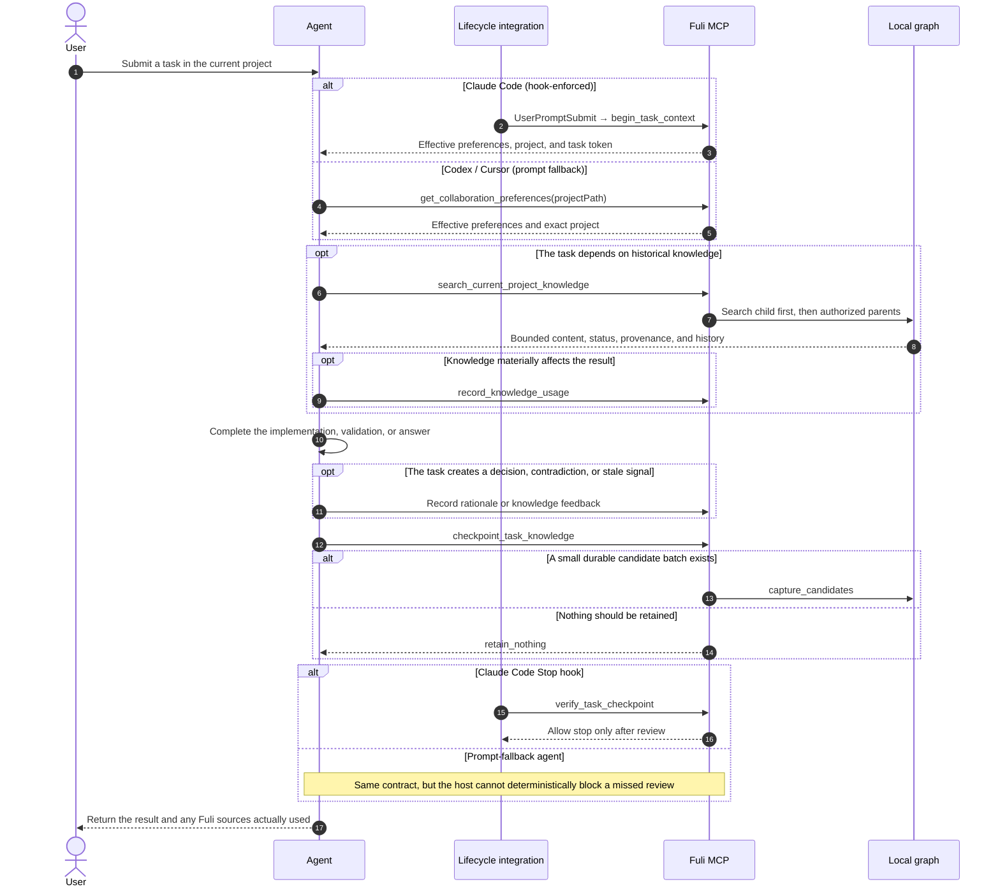

# Fuli

[中文](README.md)

Fuli is a local-first collaboration context graph for AI agents. It turns reusable knowledge,
experience, decision rationale, and preferences from human–AI project work into assets with
provenance, scope, authority, and temporal history. Codex, Claude Code, and Cursor can then reuse
those assets in later tasks instead of relearning the same context.

Fuli is not a transcript archive, and it is not an attempt to build a personality model that
replaces human judgment. AI retrieves, summarizes, warns, and executes; humans retain final
authority.

The npm package is the personal edition: personal knowledge, the graph database, and the
management UI run locally. A team-shared Provider is a separate deployment unit. Personal taste,
personality, and judgment preferences are never published into the shared layer.

## Philosophy

### 1. Measure reuse value, not knowledge volume

Fuli is built around one question:

> Without Fuli, would the agent have to relearn information that is confirmed, still valid, and
> relevant to the current task?

Node count, transcript count, and graph size are not success metrics. The product succeeds when a
past collaboration asset is reused within the correct project, time, provenance, and authority
boundaries—and reduces repeated explanation, correction, or rework.

### 2. Review every task; do not retain every task

A task may produce:

- reusable knowledge such as API conventions, runbooks, release procedures, or constraints;
- experience explaining why an approach worked or failed;
- a decision trace with options, a human choice, rationale, and later validation;
- judgment aids such as preferences, principles, taste, or personality tendencies.

It may also produce only disposable output, a guess, or a one-off choice. In that case,
`retain_nothing` is the correct result. Every task should perform a knowledge-value checkpoint, but
not every task must become stored knowledge.

### 3. Human authority outranks agent repetition

An agent may discover candidates, surface conflicts, recommend promotion, or resolve a deferred
conflict when explicitly authorized. It may not turn semantic similarity, repetition, or its own
judgment into human confirmation. Shared-knowledge promotion and sensitive project mutations use a
preview followed by an explicit, one-time, atomic action.

### 4. Assemble context, then retrieve evidence on demand

Fuli does not inject the complete history at session start. The entry step loads only effective
personal-global preferences and preferences from one exactly matched project. The agent retrieves
detailed knowledge when the task needs it. Retrieval alone is not usage; a usage event is recorded
only when an item materially affects an answer, implementation, or decision.

### 5. Preserve evolution instead of overwriting history

An old approach may have been correct under earlier conditions and later replaced. Fuli preserves
provenance, confirmation authority, time, rationale, revisions, supersession, and negative evidence
so an agent can explain both what applies now and why the past was different. Negative feedback may
lower rank or trigger review, but it never silently erases history.

### 6. Put shared knowledge in the parent; keep differences in each child

For example, hotel and flight projects can keep their own PRDs, configuration, and domain rules,
while a parent activity-platform project owns shared local-run, mock, test, and deployment runbooks:

```text
Activity platform (parent: shared runbooks)
├── Hotel project (child: hotel PRD / configuration / overrides)
└── Flight project (child: flight PRD / configuration / overrides)
```

When an agent works in the hotel project, it searches hotel-local knowledge first, then follows
explicit outgoing `PART_OF` or `USES_KNOWLEDGE_FROM` relationships to authorized sources, up to two
hops. A child item with the same stable key overrides an inherited item. Generic `RELATED_TO`
relationships do not expand scope, and project-scoped personal preferences are not inherited.

Similar items from multiple children create only a common-knowledge candidate. Current clustering
is a lexical heuristic, not proof of semantic equivalence. A human must select the canonical item,
duplicates, parent project, and rationale before an atomic promotion can occur.

### 7. Local first; no personal model in the shared layer

The personal graph stays local by default. Fuli stores structured reusable knowledge, not raw
transcripts, credentials, temporary logs, or command output. The team-shared layer contains only
confirmed project or domain knowledge with context and provenance—not personal taste, personality,
or judgment preferences.

## Agent interaction sequence

This is the simplified lifecycle for a normal task. The Chinese
[detailed sequence diagram](acceptance/智能体调用时序图.md) also covers inheritance, usage counting,
write previews, and source markers.



## Current capabilities and evidence boundaries

Core mechanisms covered by implementation and automated tests include:

- a local personal space, exact project scope, and selective parent inheritance;
- preference confirmation, deferred conflict resolution, revision history, and source markers;
- task entry and completion checkpoints, plus Claude Code entry and Stop hooks;
- decision options, rationale, and validation results supplied during initial capture;
- knowledge-usage events, negative feedback, and content-generation isolation;
- common-knowledge discovery and preview-token-protected atomic promotion.

The following must not be presented as already proven:

- the A/B thresholds in `FULI_ALIGNMENT_BENCHMARK.md` are acceptance conventions; claims that Fuli
  reduces explanation or rework require a sufficiently large set of controlled, real paired tasks;
- benchmark projects and conversations are explicitly labeled **MOCK / synthetic data**, not user or
  production data;
- the decision tool can include validation during initial capture, but it does not yet expose a
  dedicated operation for appending immutable validation results to an existing `Decision`;
- Claude Code has deterministic lifecycle hooks; Codex and Cursor currently use prompt fallback and
  must not be described as equally enforced.

## Installation

Requirements:

- Node.js 24.12 or later;
- Docker Compose v2 through Docker Desktop, Rancher Desktop, or another compatible runtime;
- approximately 4 GB of memory available to the containers.

Install globally and initialize:

```bash
npm install --global fuli-context
fuli setup
```

`fuli setup` first shows its plan and asks for confirmation. It then checks the container runtime,
initializes local Graphiti / Neo4j, creates a personal space, installs the companion Agent Skills,
and registers the `fuli` MCP with detected agents. The default setup connects only the personal
Provider; it does not simulate a team-shared service.

Open the management UI after setup:

```bash
fuli open
```

The default URL is `http://127.0.0.1:2727`.

## CLI

The global package provides two equivalent commands: `fuli` and the short alias `fl`.

| Command | Purpose |
| --- | --- |
| `fuli setup [options]` | Initialize the Provider, UI, agent integrations, and Skills; safe to rerun |
| `fuli start [options]` | Start local services |
| `fuli stop [--data-dir DIR]` | Stop services without deleting data |
| `fuli restart [options]` | Restart local services |
| `fuli status [--json]` | Show service status |
| `fuli open` | Open the management UI |
| `fuli update [setup options]` | Update the npm package and refresh local integrations |
| `fuli uninstall [--yes]` | Remove agent integrations and services while preserving knowledge data |

Common commands:

```bash
fuli --version
fuli status
fuli restart --rebuild
fuli stop
```

`start`, `restart`, and `setup` accept options such as `--data-dir DIR`,
`--personal-space NAME`, and `--port PORT`. Additional setup options include:

| Option | Purpose |
| --- | --- |
| `--yes` | Skip confirmation for unattended setup |
| `--codex-only` | Configure Codex only |
| `--skip-agents` | Do not change agent configuration or Skills |
| `--no-start` | Initialize the Provider without starting the UI |
| `--personal-only` | Use only the personal Provider; this is the default |
| `--with-dev-public` | Start a development shared Provider for local integration work only |

Update:

```bash
fuli update
```

The update flow verifies that it will not downgrade the installation, stops the old services,
installs `fuli-context@latest`, and refreshes agent integrations. Existing knowledge, configuration
backups, and Neo4j volumes remain intact. Reuse any custom setup options during updates.

Uninstall:

```bash
fuli uninstall
npm uninstall --global fuli-context
```

Automated uninstall does not permanently delete the personal graph, which allows a later install to
reuse the same data.

## Agent integrations and primary tools

Fuli installs the `capturing-session-knowledge` and `grilling-project` Skills for supported agents.
Claude Code uses `UserPromptSubmit` and `Stop` hooks for the task lifecycle. Codex's user-level
`AGENTS.md` and Cursor instructions use prompt fallback. Preference content remains in local Fuli as
the single source of truth and is not copied into agent configuration.

| Tool | Purpose |
| --- | --- |
| `begin_task_context` | Hook entry: create a task token and return effective context |
| `get_collaboration_preferences` | Fallback entry: read global and exact-project preferences |
| `search_current_project_knowledge` | Search the child first, then authorized knowledge sources |
| `search_knowledge_graph` | Run a general query within an explicit bounded scope |
| `record_knowledge_usage` | Record a citation or application that materially affected the result |
| `record_knowledge_feedback` | Preserve rejection, failed validation, contradiction, or stale evidence |
| `record_decision_trace` | Store options, rejected alternatives, rationale, and optional initial validation |
| `capture_session_knowledge` | Store a small structured batch of durable candidates |
| `checkpoint_task_knowledge` | Complete review with `capture_candidates` or `retain_nothing` |
| `discover_common_knowledge_candidates` | Read-only discovery of possible parent-project knowledge |
| `preview_common_knowledge_promotion` | Preview a human-confirmed promotion |
| `apply_common_knowledge_promotion` | Apply the preview atomically with a one-time token |
| `resolve_deferred_preference_conflict` | Resolve an AI-deferred conflict only when a task needs it |

## Privacy and safety boundaries

- Personal knowledge is written to the local Provider.
- Agents distill structured knowledge instead of storing raw transcripts.
- Tokens, cookies, private keys, credentials, private contact details, temporary logs, and raw command
  output must not enter the graph.
- Graphiti's remote-LLM path is disabled; embeddings are currently computed locally.
- Searches are bounded by personal space and project scope instead of mixing every project.
- Shared promotion requires auditable human confirmation. Agent usage evidence can promote an item
  only as far as `agent_confirmed`.
- Fuli is not a real-time monitoring or Git service; current state must be read from the relevant
  source system.

## Local services

| Service | Default address |
| --- | --- |
| Personal Neo4j Browser / Bolt | `127.0.0.1:7474` / `127.0.0.1:7687` |
| Personal Provider | `127.0.0.1:8787` |
| Fuli management UI | `127.0.0.1:2727` |

If a port is occupied, Docker Compose is unavailable, or the container runtime is not running,
setup stops before modifying agent configuration and reports the cause.

## Acceptance and development

- [Alignment Benchmark](FULI_ALIGNMENT_BENCHMARK.md)
- [Chinese acceptance index](acceptance/README.md)
- [Knowledge retrieval and confirmation diagrams](acceptance/知识检索与确认流程图.md)

```bash
npm install
npm test
npm run test:package
```

Provider validation:

```bash
python3 -m compileall -q graph-provider/fuli_graph
python3 -m pytest -q graph-provider/tests
docker compose -f compose.graphiti.yml config --quiet
```

`npm run test:package` builds the web UI, creates a real npm tarball, installs it into an isolated
global prefix, and verifies `fuli` / `fl`, version output, help output, and the packaged UI. Tests,
QA screenshots, and internal design documents are excluded from the npm package.

## License

[Apache-2.0](LICENSE)
