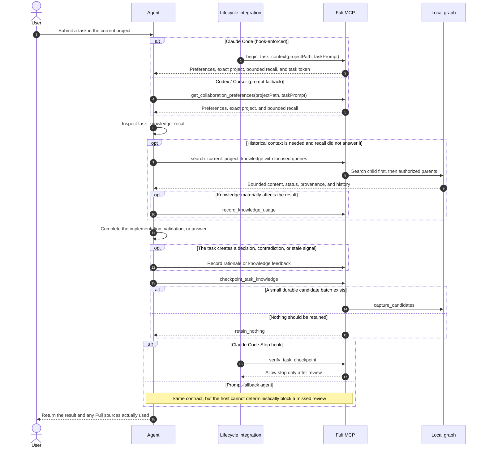

<p align="center">
  
</p>

<h1 align="center">Fuli</h1>

<p align="center">
  English · <a href="README.zh-CN.md">简体中文</a>
</p>

<p align="center">
  <a href="https://www.npmjs.com/package/fuli-context"></a>
  <a href="https://www.npmjs.com/package/fuli-context"></a>
  <a href="LICENSE"></a>
</p>

Fuli is a local-first collaboration relationship graph for AI agents. Continued human–Agent
dialogue gradually connects projects, people, decisions, preferences, workflow steps, and evidence.
Those nodes may point to Fuli-local content, an external knowledge base, or another data source.
Codex, Claude Code, and Cursor can then reuse the taste, personality, judgment preferences, and
working methods formed through that collaboration.

Fuli is not a transcript archive or a knowledge base whose goal is to collect more documents, and
it is not an attempt to build a personality model that replaces human judgment. AI retrieves,
summarizes, warns, and executes; humans retain final authority.

## npm packages

| Package | Status | Intended use |
| --- | --- | --- |
| [`fuli-context`](https://www.npmjs.com/package/fuli-context) | Available | Personal edition; personal knowledge, the graph database, and the management UI all run locally |
| Fuli Server npm package | In development | A separate server for team-shared deployments; not yet published |

`fuli-context` is currently the only available npm package. The shared layer never contains
personal taste, personality, or judgment preferences.

## Philosophy

### 1. Measure reuse value, not knowledge volume

Fuli is built around one question:

> Without Fuli, would the agent have to relearn information that is confirmed, still valid, and
> relevant to the current task?

Node count, transcript count, and graph size are not success metrics. The product succeeds when a
past collaboration asset is reused within the correct project, time, provenance, and authority
boundaries—and reduces repeated explanation, correction, or rework.

### 2. Review every task; do not retain every task

A task may produce:

- reusable knowledge such as API conventions, runbooks, release procedures, or constraints;
- experience explaining why an approach worked or failed;
- a decision trace with options, a human choice, rationale, and later validation;
- judgment aids such as preferences, principles, taste, or personality tendencies.

It may also produce only disposable output, a guess, or a one-off choice. In that case,
`retain_nothing` is the correct result. Every task should perform a knowledge-value checkpoint, but
not every task must become stored knowledge.

### 3. Human authority outranks agent repetition

An agent may discover candidates, surface conflicts, recommend promotion, or resolve a deferred
conflict when explicitly authorized. It may not turn semantic similarity, repetition, or its own
judgment into human confirmation. Shared-knowledge promotion and sensitive project mutations use a
preview followed by an explicit, one-time, atomic action.

### 4. Assemble context, then retrieve evidence on demand

Fuli does not inject the complete history at session start. The entry step always loads effective
personal-global preferences, preferences from one exactly matched project, and explicitly
propagating preferences from authorized parent projects. When the current task signals that a
stable prior fact, method, URL, decision, release, deployment, or authentication runbook may matter,
the same step also performs a small bounded recall from that project and its authorized knowledge
sources. The agent uses focused on-demand search when more evidence is needed.
Retrieval alone is not usage; a usage event is recorded only when an item materially affects an
answer, implementation, or decision.

### 5. Preserve evolution instead of overwriting history

An old approach may have been correct under earlier conditions and later replaced. Fuli preserves
provenance, confirmation authority, time, rationale, revisions, supersession, and negative evidence
so an agent can explain both what applies now and why the past was different. Negative feedback may
lower rank or trigger review, but it never silently erases history.

### 6. Put shared knowledge in the parent; keep differences in each child

For example, hotel and flight projects can keep their own PRDs, configuration, and domain rules,
while a parent activity-platform project owns shared local-run, mock, test, and deployment runbooks:

```text
Activity platform (parent: shared runbooks)
├── Hotel project (child: hotel PRD / configuration / overrides)
└── Flight project (child: flight PRD / configuration / overrides)
```

When an agent works in the hotel project, it searches hotel-local knowledge first, then follows
explicit outgoing `PART_OF` or `USES_KNOWLEDGE_FROM` relationships to authorized sources, up to two
hops. A child item with the same stable key overrides an inherited item. Project-scoped personal
preferences remain exact by default; only preferences explicitly marked `descendants` or
`selected_projects` may propagate over the same authorized relationships, with origin project,
path, and distance preserved. Equally near parent conflicts require human judgment and are never
resolved by weight. Generic `RELATED_TO` relationships do not expand scope automatically; search
returns only a one-time read-only expansion suggestion that the Agent must ask the user to approve.

Similar items from multiple children create only a common-knowledge candidate. A shared preference
across projects without one common parent likewise creates only a personal-global candidate while
preserving each source text, qualifier, and provenance. Current clustering is a lexical heuristic,
not proof of semantic equivalence. A human must choose the content, scope, and rationale before it
can apply.

### 7. Local first; no personal model in the shared layer

The personal graph stays local by default. Fuli stores structured reusable knowledge, not raw
transcripts, credentials, temporary logs, or command output. The team-shared layer contains only
confirmed project or domain knowledge with context and provenance—not personal taste, personality,
or judgment preferences.

## Practical use: classification, scope, project resolution, and retrieval

### Decide what to store before deciding where to store it

Content type and effective scope are independent dimensions. The first three rows are personal
collaboration preferences and carry a `profileAspect`. Project facts have no `profileAspect` and do
not appear on the Personal preferences page.

| Type | What belongs here | Example |
| --- | --- | --- |
| Taste (`taste`) | Outcomes, styles, and quality directions the user explicitly likes or rejects across UI, writing, product, architecture, or engineering work | “Use fewer large gradients and avoid cards nested inside cards.” |
| Personality (`personality`) | A stable working or collaboration trait explicitly described by the user | “I communicate directly and want the Agent to move work forward proactively.” |
| Judgment preference (`judgment_preference`) | Decision conditions, priorities, risk posture, and operational boundaries used when making trade-offs | “Discuss directional ambiguity first; never `git push` without explicit authorization.” |
| Project knowledge | Reusable objective facts, terminology, requirements, routes, APIs, architecture, rationale, and runbooks | “A GitHub Release triggers Fuli's npm publication.” |

Four questions provide a quick classifier: “What outcome do I want?” is taste; “How do I work over
the long term?” is personality; “How do I decide under a trade-off?” is judgment preference; and
“How does this system objectively work?” is project knowledge. One-off commands, temporary output,
unverified guesses, raw chat, and credentials are not retained.

Personality is not a catch-all category for everything learned about a person. Only an explicit,
stable self-description can be confirmed with a human basis. A personality inferred by an Agent
from one behavior must remain `pending`; it cannot masquerade as human-confirmed. An empty
Personality filter on `/preferences` therefore usually means there is no qualifying item in the
selected scope, not that capture failed. “Keep copy concise” is more likely taste, while “do not
push without authorization” is more likely a judgment preference. To make the intent explicit,
say: `This is a long-term collaboration trait; save it as a personal-global personality preference: I communicate directly.` An Agent-inferred candidate can be confirmed, corrected, or invalidated
by the user from `/preferences` or `/flreview`.

### Personal-global, project-scoped, and shared

| Scope | When to use it | Key write fields | Retrieval rule |
| --- | --- | --- | --- |
| Personal-global preference | The behavior should remain the same in unrelated projects | `targetKind: "personal"`; omit `personalProjectId`; set `profileAspect` | Loaded for every task |
| Project-scoped personal preference | The collaboration behavior belongs to one project or project family | Same fields plus the exact `personalProjectId`; default to `local_only` and never inherited by child projects; explicitly use `descendants` or `selected_projects` when propagation is intended | Exact project wins; propagation follows only the explicit inheritance mode and authorized relationships, and score never resolves a conflict automatically |
| Project knowledge | A fact belongs to one project or to a designated parent/source project | `targetKind: "personal"`; set `personalProjectId`; omit `profileAspect` | Search the current project first, then authorized `PART_OF` / `USES_KNOWLEDGE_FROM` sources up to two hops |
| Team-shared knowledge | Human-confirmed project or domain knowledge genuinely needed by a team | `targetKind: "project"` after preview/review | Visible only from explicitly selected or subscribed public projects; personal preferences never enter this layer |

To choose a preference scope, ask: **Should this change the Agent's behavior in a completely
unrelated project?** If yes, use personal-global. If it applies only to Fuli, use a project-scoped
preference. If it applies to a project family, keep it project-scoped and explicitly choose whether
it may propagate to descendants. Do not turn an objective project fact into a personal-global item
merely because more than one project may reuse it. Put it in an explicit parent or knowledge-source
project and add a directional authorization relation. When global and project-scoped variants have
the same stable `attributes.preferenceKey`, human/source confirmation authority is resolved first;
at equal authority, the exact project variant overrides the global one.

### How Fuli identifies the current project

Fuli matches only stable `project_id` values already registered under Personal projects; it does
not guess from fuzzy directory similarity. Normally the `project_id` matches the repository
directory name, so `/workspace/fuli` maps to `fuli`. Standard calls pass only the current working
directory, and resolution follows this order:

1. Find the nearest Git repository root and match its directory name exactly to a registered
   `project_id`.
2. For a Codex worktree, recover the original repository ID from its `.git` pointer.
3. Match the current directory name exactly to a registered project ID.
4. At a workspace root, match one registered direct child only when exactly one child contains
   `.git`, `package.json`, `pyproject.toml`, `Cargo.toml`, or `go.mod`.
5. Multiple candidates return `ambiguous`; no candidate returns `unmatched`. Neither state applies
   project preferences or guesses a project.

For an unregistered repository with an unambiguous identity, the installed capture skill may call
`upsert_personal_project` before the first project-scoped write to create a minimal local private
project. It never creates or subscribes to a public project automatically. If a workspace has
multiple candidates, run the Agent from the exact project directory or explicitly register and
select the project first.

### Which tool the Agent calls and when

Normal use does not require manual MCP calls: submit a task to the Agent from the project directory.
The Claude Code hook calls `begin_task_context`; Codex and Cursor prompt fallback call the following
once at the start of each task:

```json
{
  "tool": "get_collaboration_preferences",
  "arguments": {
    "projectPath": "/workspace/fuli",
    "taskPrompt": "Fix npm publishing and reuse this project's existing release conventions."
  }
}
```

The important part of a matched response resembles:

```json
{
  "context": {
    "personal_project_id": "fuli",
    "project_resolution": {
      "status": "matched",
      "basis": "repository_root",
      "personal_project_id": "fuli"
    }
  },
  "effective_preferences": ["personal-global preferences + exact fuli preferences"]
}
```

If entry-time `task_knowledge_recall` did not answer a stable project fact, search with one to four
short queries centered on an action, artifact, target system, or identifier. Do not use the full
user request verbatim as the only query:

```json
{
  "tool": "search_current_project_knowledge",
  "arguments": {
    "projectPath": "/workspace/fuli",
    "queries": ["npm publication runbook", "GitHub Release trigger"],
    "includePending": false
  }
}
```

At task end, hook mode calls `checkpoint_task_knowledge`: use `capture_candidates` only for a small,
durable, evidence-backed batch; otherwise use `retain_nothing`. A prompt-fallback Agent applies the
same rule and writes through `capture_session_knowledge`. Personal preferences set the correct
`profileAspect` and stable `attributes.preferenceKey`; project facts omit `profileAspect`. If
automatic capture is disabled under Settings, writes return `capture_disabled` and no category is
created.

Run these local contract tests to check that the README and project-path behavior still match the
implementation:

```bash
npm run test:node -- test/acceptance-docs.test.js test/project-path-context.test.js
```

## Agent interaction sequence

This is the simplified lifecycle for a normal task. The Chinese
[detailed sequence diagram](acceptance/智能体调用时序图.md) also covers inheritance, usage counting,
write previews, and source markers.



## Read-only external knowledge

One knowledge-base connection can be bound to one or more existing personal projects without
granting Fuli write access to the source. Each target keeps independent retrieval mode, sync
cursor, and error state. The Connections page supports multi-project assignment, connection
checks, manual synchronization, disconnection, and a per-project conflict switch.

| Connector | Read path | Current boundary |
| --- | --- | --- |
| MCP | Resources `list/read`; configured `search` / `fetch` tools | Default; HTTPS or loopback HTTP, plus stdio |
| Notion | Page Markdown and Data Source queries | Current `2026-03-11` API; explicit page or data-source IDs |
| Feishu / Lark | Wiki nodes, search, and Docx raw content | Docx text only; search may require a user access token |
| RAG Retrieval API | Dify-compatible external-knowledge retrieval contract | Live only; for compatible endpoints or adapters in front of systems such as RAGFlow |
| Trusted custom code | Local ESM `sync` / `retrieve` contract | Explicitly installed trusted code, not a sandbox |

<a id="connect-external-knowledge"></a>

### Connect one or more knowledge bases to a project

One personal project can have multiple knowledge connections, and one connection can target
multiple personal projects. Each submission adds a connection instead of replacing an existing
one. Source configuration is stored once, while retrieval mode, synchronization state, and errors
are isolated per target. Use Bind projects on an existing connection to add or remove targets.

1. Create or confirm the target under Personal projects.
2. If the source needs a token, set it in the environment that starts Fuli, then start or restart
   the service. The binding stores only the environment-variable name. For example, run
   `export PROJECT_KB_TOKEN='...'` and then `fl restart`.
3. Open `http://127.0.0.1:2727/connections`. Under External knowledge, enter a connection name,
   connector, one or more bound projects, and retrieval mode.
4. For MCP HTTP, enter the server URL and optional token environment-variable name. For MCP stdio,
   enter its command and arguments. For Notion, enter the token environment-variable name and Page
   IDs or Data Source IDs. For Feishu/Lark, enter the token environment-variable name, region, and
   an explicit Space ID, root-node token, or node tokens. For RAG Retrieval API, enter a
   Dify-compatible endpoint, knowledge-base IDs, and an optional token environment-variable name.
   A custom connector takes a trusted local ESM module and source JSON.
5. Select Add connection and then Check. A successful `mirror` or `hybrid` binding can be synced;
   a `live` binding reads its source when an Agent query runs.
6. After creation, use Bind projects to add or remove projects and select a mode per project.

The project graph shows an External knowledge source node and a Uses external knowledge edge for
each assignment. This is a read-only projection of connection configuration. Live bodies are still
retrieved only when an Agent invokes `search_connected_knowledge`; showing the node does not mirror
content locally.

Retrieval modes differ as follows:

- `live`: read the third party at query time without storing a body mirror in Fuli; the source must
  be available.
- `mirror`: manually mirror read-only content into the bound personal project and query the graph.
- `hybrid`: use both the local mirror and live source results; recommended when the connector
  supports both capabilities.

Bindings support `live`, `mirror`, and `hybrid` modes. Mirror content is written only to the bound
personal project as `observed`, `pending`, `restricted`, local-only knowledge. Credentials are read
from named environment variables and are not stored in binding JSON. Source writes are never part
of the connector contract. Documents that look like credential material are skipped individually,
reported by count, and never enter the graph or Agent context.

<a id="external-knowledge-conflict-policy"></a>

### Conflict policy

The conflict policy is stored per personal project and applies across that project's personal
graph, all external bindings, and explicitly selected public projects:

- Ask in the Agent conversation is the default. The Agent presents conflicting content, source,
  and scope separately so the user can choose.
- Allow an Agent decision lets the Agent select the stronger or fresher source for the current
  response and requires it to explain the basis. It never confirms, invalidates, overwrites, or
  writes back any knowledge.

From the project directory, an Agent can be asked: `Search the current project and connected knowledge bases for the payment callback contract; list conflicting sources and ask me to decide.`

`search_connected_knowledge` keeps personal-graph evidence, each external binding, and explicitly
selected public projects as separate source sets. Public-project aggregation is **Beta**. When an
Agent finds a material conflict, the default policy is to show it in the conversation and ask the
user; the optional Agent-decision policy applies to the current response only and cannot confirm,
invalidate, or rewrite any source. Direct external-to-public binding, reviewed public promotion,
scheduled sync, webhooks, and full deletion reconciliation remain **TODO**.

See the [external-knowledge architecture and connector contract](docs/external-knowledge-architecture.md), and the [public-workspace and personal-graph architecture](docs/public-personal-architecture.md).

## Current capabilities and evidence boundaries

Core mechanisms covered by implementation and automated tests include:

- a local personal space, exact project scope, and selective parent inheritance;
- preference confirmation, deferred conflict resolution, revision history, and source markers;
- bounded task-prompt recall, focused on-demand retrieval, and material-usage auditing;
- task entry and completion checkpoints, plus Claude Code entry and Stop hooks;
- decision options, rationale, and validation results supplied during initial capture;
- knowledge-usage events, negative feedback, and content-generation isolation;
- persistent scoped knowledge reviews with pause/resume watermarks;
- common-knowledge discovery and preview-token-protected atomic promotion;
- read-only multi-project MCP, Notion, Feishu/Lark, Dify-compatible RAG Retrieval API, and trusted-code bindings with connected retrieval.

The following must not be presented as already proven:

- the A/B thresholds in `FULI_ALIGNMENT_BENCHMARK.md` are acceptance conventions; claims that Fuli
  reduces explanation or rework require a sufficiently large set of controlled, real paired tasks;
- benchmark projects and conversations are explicitly labeled **MOCK / synthetic data**, not user or
  production data;
- the decision tool can include validation during initial capture, but it does not yet expose a
  dedicated operation for appending immutable validation results to an existing `Decision`;
- Claude Code has deterministic lifecycle hooks; Codex and Cursor currently use prompt fallback and
  must not be described as equally enforced;
- selected public projects in connected retrieval are Beta; external-to-public promotion and
  background delta synchronization are not implemented.

## Installation

Requirements:

- Node.js 24.12 or later;
- the default container mode needs Docker Compose v2 through Docker Desktop, Rancher Desktop, or a compatible runtime;
- macOS and Linux can use native mode without a VM; it requires Java 21 and `uv` (Python 3.12);
- on a memory-constrained Mac, use
  `fuli setup --runtime-mode native --memory-profile low --adaptive-memory`. Container mode remains the compatibility default and is never changed automatically.

Install globally and initialize:

```bash
npm install --global fuli-context
fuli setup
```

`fuli setup` first shows its plan and asks for confirmation. It then checks the container runtime,
initializes local Graphiti / Neo4j, creates a personal space, installs the companion Agent Skills,
and registers the `fuli` MCP with detected agents. The default setup connects only the personal
Provider; it does not simulate a team-shared service.

Open the management UI after setup:

```bash
fuli open
```

The default URL is `http://127.0.0.1:2727`.

The Settings page manages all seven local Fuli ports, graph runtime mode, LAN access, automatic capture,
Agent access, UI language, and the resource refresh interval. Run `fuli restart` after saving port,
runtime, or LAN changes;
the refresh interval applies immediately. The same page polls real memory and disk usage for the
management service, Providers, Neo4j, application files, and local data. Memory is sampled on every
poll; disk usage is sampled at most once per minute, with separate timestamps. Missing container metrics
are shown as partial instead of being replaced with mock values. Native Provider and Neo4j processes
are included. Browser-tab memory is excluded; shared container-VM overhead is excluded in container mode.

## CLI

The global package provides two equivalent commands: `fuli` and the short alias `fl`.
CLI help, prompts, status output, and errors are always in English and do not follow the web or
system locale. User data such as paths and space names is displayed unchanged.

| Command | Purpose |
| --- | --- |
| `fuli --help` / `fuli -h` | List every public command and its available options |
| `fuli --version` / `fuli -v` | Print the installed Fuli CLI version |
| `fuli setup [options]` | Initialize the Provider, UI, agent integrations, and Skills; safe to rerun |
| `fuli start [options]` | Check Agent integrations, then start the Provider and UI; optionally open a browser, rebuild containers, or enable LAN access |
| `fuli stop [--data-dir DIR]` | Stop services without deleting data |
| `fuli restart [options]` | Restart local services using the same runtime options as `start` |
| `fuli status [--json] [--data-dir DIR] [--port PORT]` | Show UI, personal graph, and shared-service status; `--json` emits machine-readable output |
| `fuli open [--data-dir DIR]` | Open the current management UI in the default browser |
| `fuli graph export --output DIR [--mode container\|native]` | Export graph data as a checksummed, copyable offline bundle |
| `fuli graph import --input DIR [--target-mode container\|native] [--yes]` | Verify and replace target graph data, preserving an automatic pre-import rollback bundle |
| `fuli update [setup options]` | Update the npm package and refresh local integrations |
| `fuli uninstall [--yes] [--data-dir DIR]` | Remove agent integrations and services while preserving knowledge data and Neo4j volumes |

Common commands:

```bash
fuli --version
fuli status
fuli restart --rebuild
fuli start --lan
fuli graph export --output "$HOME/Backups/fuli-graph"
fuli stop
```

Connect a deployed `fuli-workspace` service:

```bash
fuli connect-workspace \
  --url http://127.0.0.1:8789 \
  --token-file /path/to/private-token
fuli restart
```

The command verifies discovery, protocol version, and token scope before atomically updating the
local runtime configuration with mode `0600`. It never prints the token, token-file path, or remote
principal ID. Non-loopback services must use HTTPS. The current `fuli-workspace-v1` adapter enables
discovery, explicit subscriptions, and queries; publishing, contributions, and review remain off
until those protocol mappings are implemented.

`start` and `restart` accept `--data-dir DIR`, `--personal-space NAME`, `--port PORT`, `--open`,
`--rebuild`, `--lan`, and `--no-lan`. When port or LAN flags are omitted, the saved Settings values
are used. LAN mode listens on private IPv4 addresses and prints the reachable URLs, the
`fuli` username, and a temporary access code generated for that start. The default remains
loopback-only; internal Providers and Neo4j ports are never exposed by `--lan`. LAN mode uses
HTTP Basic Auth and is intended only for trusted home or office Wi-Fi, not public deployment.
Before starting, `fuli start` performs a read-only check of detected Agent MCP, Skill, Codex bootstrap,
and Claude lifecycle integrations. If any are missing or outdated, it still starts the local services
and tells you to run `fuli setup`; it never applies setup changes implicitly.

`setup` and `update` accept:

| Option | Purpose |
| --- | --- |
| `--yes` | Skip confirmation for unattended setup |
| `--codex-only` | Configure Codex only |
| `--data-dir DIR` | Use a specific data and configuration directory |
| `--personal-space NAME` | Set the personal-space name; defaults to `Personal` |
| `--port PORT` | Set the management UI port; defaults to `2727` |
| `--runtime-mode container\|native` | Select containers or native processes; defaults to `container`, with native mode currently on macOS/Linux |
| `--memory-profile low\|balanced` | Select Neo4j's memory budget; fresh installs default to `balanced` |
| `--adaptive-memory` | Enable on-demand wake and staged idle sleep, coordinated by the management service |
| `--no-adaptive-memory` | Disable idle sleep and keep graph services running |
| `--skip-agents` | Do not change agent configuration or Skills |
| `--no-start` | Initialize the Provider without starting the UI |
| `--personal-only` | Use only the personal Provider; this is the default |
| `--with-dev-public` | Start a development shared Provider for local integration work only |

The `low` profile uses a 128 MiB initial heap, 256 MiB maximum heap, and 64 MiB page cache.
`balanced` uses 256 MiB, 512 MiB, and 256 MiB respectively. The low profile does not add a hard
container memory limit: it lowers steady memory use while leaving room for Neo4j's native memory.
It may cause more garbage collection and disk reads under bulk writes, large traversals, or high
concurrency, but it does not change transaction semantics, storage format, or data volumes. If those
workloads become slow or fail for lack of heap, run `fuli setup --memory-profile balanced --yes`.
The selected profile is saved and reused by later setup, update, start, and restart commands.

Adaptive memory is a lifecycle policy independent of the Neo4j memory profile. When enabled, the
lightweight management service stays available. Real MCP tools, MCP resources, and graph requests
acquire a runtime lease and wake services on demand. After the final lease is released, the personal
Provider stops after 60 idle seconds by default and Neo4j stops after 180 idle seconds. Volumes are
preserved and the next request restores the same data. Active calls renew their leases and cannot be
interrupted by idle timers; a crashed client lease expires after at most 180 seconds. These durations
are current product defaults, not measured hardware thresholds.

This mode trades idle memory for first-request cold-start latency and additional disk reads. Health,
runtime-status, and resource polling do not wake the graph, and `fuli status` treats intentional sleep
as healthy. The management service must remain running to wake graph services, so `--no-start` only
saves the policy for a later start. In container mode the policy stops only Fuli Provider and Neo4j
containers; it does not shut down Rancher Desktop, Docker Desktop, Kubernetes, or the container VM
itself. Native mode directly stops the corresponding Provider and Neo4j processes, so no shared VM
overhead remains while idle.

Project Agent identities remain control-plane records rather than one resident process per identity.
Physical executors share leases by executor ID. Fuli starts and stops only executors with an explicitly
injected managed lifecycle adapter; host-owned external executors such as Codex are never started or
killed implicitly. The current minimum-memory combination is:

```bash
fuli setup --yes --runtime-mode native --memory-profile low --adaptive-memory
```

The two modes use separate data directories. Switching preserves the old mode's data and never
merges changes in the background. To migrate, export while the source mode is still active, then
install or switch to the target mode and import:

```bash
# Rancher / Docker -> native
fuli graph export --mode container --output "$HOME/Backups/fuli-container"
fuli setup --yes --runtime-mode native --memory-profile low --adaptive-memory
fuli graph import --target-mode native --input "$HOME/Backups/fuli-container" --yes
```

Swap `container` and `native` for the reverse direction. Export briefly stops the source database
and resumes only services that were actually running beforehand. Import validates the manifest and
every dump's SHA-256 before stopping the target. It preserves the old target under `backups/graph`
inside the data directory and attempts an immediate rollback if loading fails. Let active Agent graph
writes finish before either operation.

After loading, Fuli uses the target installation's bootstrap token to rotate local Provider access
credentials and atomically updates the runtime configuration; plaintext access tokens are never added
to the bundle. Unmanaged external Workspace connections are preserved for a same-device migration.
Reconnect their credentials separately after moving the bundle to another device.

The bundle is a directory containing `manifest.json`, `personal.dump`, and an optional
`workspace.dump`; it can be copied to another disk or machine. Container mode transfers files through
the Docker API, so the backup location does not need to be shared with Rancher. Dumps use the pinned
Neo4j 5.26 format and are intended for the two Fuli runtime modes or a compatible Neo4j 5.26 setup;
they are not a generic CSV/JSON interchange format for arbitrary databases.

Update:

```bash
fuli update
```

The update flow verifies that it will not downgrade the installation, stops the old services,
installs `fuli-context@latest`, and refreshes agent integrations. Existing knowledge, configuration
backups, and Neo4j volumes remain intact. Reuse any custom setup options during updates.

Uninstall:

```bash
fuli uninstall
npm uninstall --global fuli-context
```

Automated uninstall does not permanently delete the personal graph, which allows a later install to
reuse the same data.

## Agent integrations and primary tools

Fuli installs the `capturing-session-knowledge`, `grilling-project`, and `flreview` Skills for
supported agents. `/flreview` asks FULI for ranked candidates, then the invoking Agent generates a
fresh interactive review artifact. FULI remains the durable source of truth and write surface; no
permanent review tab or one-question-at-a-time chat flow is required.
Claude Code uses `UserPromptSubmit` and `Stop` hooks for the task lifecycle. Codex's user-level
`AGENTS.md` and Cursor instructions use prompt fallback. Preference content remains in local Fuli as
the single source of truth and is not copied into agent configuration.

FULI also exposes read-only `fuli://` resources for each local personal project and for global taste.
Agents with MCP mention support can select them from the `@` picker; a project resource selects one
exact project and never expands the search to other projects or `RELATED_TO` projects.

When a task needs a taste or judgment recommendation, `get_user_taste_skill` generates a bounded,
read-only `user-taste` Skill projection from the effective personal profile and prior task data.
The projection labels evidence status and scope, returns task-matched recommendations, and is
regenerated as preferences are added or revised. It never overwrites a user-authored taste Skill;
the durable graph remains the source of truth.

| Tool | Purpose |
| --- | --- |
| `begin_task_context` | Hook entry: resolve the task, run bounded recall when signaled, and create a task token |
| `get_collaboration_preferences` | Fallback entry: read effective preferences and bounded task recall |
| `get_user_taste_skill` | Generate the current evidence-labeled taste Skill projection and task recommendations |
| `search_current_project_knowledge` | Search the child first, then authorized knowledge sources |
| `search_knowledge_graph` | Run a general query within an explicit bounded scope |
| `search_connected_knowledge` | Search the graph, project-bound read-only sources, and selected public projects without merging provenance |
| `record_knowledge_usage` | Record a citation or application that materially affected the result |
| `record_knowledge_feedback` | Preserve rejection, failed validation, contradiction, or stale evidence |
| `record_decision_trace` | Store options, rejected alternatives, rationale, and optional initial validation |
| `capture_session_knowledge` | Store a small structured batch of durable candidates |
| `checkpoint_task_knowledge` | Complete review with `capture_candidates` or `retain_nothing` |
| `discover_common_knowledge_candidates` | Read-only discovery of possible parent-project knowledge |
| `preview_common_knowledge_promotion` | Preview a human-confirmed promotion |
| `apply_common_knowledge_promotion` | Apply the preview atomically with a one-time token |
| `resolve_deferred_preference_conflict` | Resolve an AI-deferred conflict only when a task needs it |
| `start_knowledge_review` | Start or resume an exact personal review scope |
| `list_knowledge_review_candidates` | Rank candidates by time, conflicts, weight, and cross-session repetition |
| `record_knowledge_review_progress` | Save keep, update, invalidate, skip, or defer outcomes |
| `finish_knowledge_review` | Pause, or complete and advance the next-review watermark |

## Privacy and safety boundaries

- Personal knowledge is written to the local Provider.
- Agents distill structured knowledge instead of storing raw transcripts.
- Tokens, cookies, private keys, credentials, private contact details, temporary logs, and raw command
  output must not enter the graph.
- Graphiti's remote-LLM path is disabled; embeddings are currently computed locally.
- Searches are bounded by personal space and project scope instead of mixing every project.
- External connectors never write to third-party sources; raw credentials are rejected from stored
  binding configuration.
- Shared promotion requires auditable human confirmation. Agent usage evidence can promote an item
  only as far as `agent_confirmed`.
- Fuli is not a real-time monitoring or Git service; current state must be read from the relevant
  source system.

## Local services

| Service | Default loopback address | Availability |
| --- | --- | --- |
| Fuli management UI | `127.0.0.1:2727` | Always |
| Personal Provider | `127.0.0.1:8787` | Always |
| Personal Neo4j Browser / Bolt | `127.0.0.1:8060` / `127.0.0.1:7687` | Always |
| Development shared Provider | `127.0.0.1:8788` | `--with-dev-public` only |
| Development shared Neo4j Browser / Bolt | `127.0.0.1:7475` / `127.0.0.1:7688` | `--with-dev-public` only |

These seven ports can be changed in Settings. Provider and Neo4j bindings remain loopback-only even
when the management UI is started in LAN mode.

To access the UI from another device on the same Wi-Fi, run `fuli start --lan`. Starting LAN mode
from a loopback-only runtime safely restarts only the management UI and preserves Provider and
graph data. Disable LAN in Settings and run `fuli restart`, or run `fuli restart --no-lan`, to return
to loopback-only mode. Starting LAN mode again rotates the temporary access code.

If a port is occupied, Docker Compose is unavailable, or the container runtime is not running,
setup stops before modifying agent configuration and reports the cause.

## Acceptance and development

- [Alignment Benchmark](FULI_ALIGNMENT_BENCHMARK.md)
- [Chinese acceptance index](acceptance/README.md)
- [Knowledge retrieval and confirmation diagrams](acceptance/知识检索与确认流程图.md)
- [Read-only external-knowledge architecture](docs/external-knowledge-architecture.md)

```bash
npm install
npm test
npm run test:package
npm run test:external-knowledge:live
```

The external-knowledge live test temporarily downloads two public official documentation
repositories, validates read-only synchronization and retrieval, then removes the complete
temporary directory. It is network-dependent and is not part of the default test suite.

Provider validation:

```bash
python3.12 -m venv .venv
. .venv/bin/activate
python -m pip install "./graph-provider[dev]"
python -m compileall -q graph-provider/fuli_graph
python -m pytest -q graph-provider/tests
docker compose -f compose.graphiti.yml config --quiet
```

`npm run test:package` builds the web UI, creates a real npm tarball, installs it into an isolated
global prefix, and verifies `fuli` / `fl`, version output, help output, and the packaged UI. Tests,
QA screenshots, and internal design documents are excluded from the npm package.

## License

[Apache-2.0](LICENSE)
