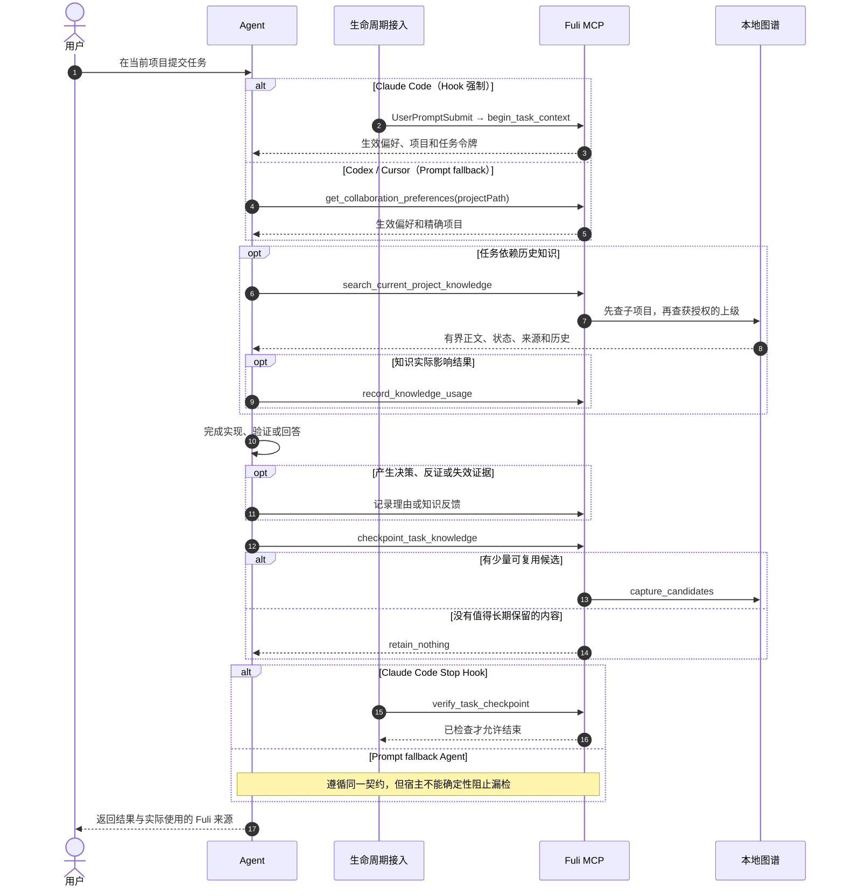

# 复利（Fuli）

[English](README.en.md)

复利是一个面向 AI Agent 的本地优先协作上下文图谱。它把人与 AI 在项目中产生的、经得起
复用的知识、经验、决策理由和偏好组织成有来源、有作用域、有时间关系的资产，让 Codex、
Claude Code 和 Cursor 在后续任务中少重复学习一次。

复利不是聊天记录仓库，也不试图建立一个替代人的“人格模型”。AI 负责检索、提醒、归纳和
执行；人始终保留最终判断权。

当前 npm 包是个人版：个人知识、图数据库和管理界面都运行在本机。团队共享 Provider 是
独立部署的服务单元，不会把个人品味、个性或判断偏好发布到公共层。

## 项目理念

### 1. 衡量复用价值，而不是知识数量

复利的核心问题是：

> 如果没有 Fuli，Agent 是否需要重新学习一条已经确认、仍然有效且与当前任务相关的信息？

节点数、对话数和图谱规模不是成功指标。真正需要验证的是：历史资产能否在正确的项目、时间
和权威边界内被再次使用，并减少重复解释、修正和返工。

### 2. 每个任务都检查价值，但不强迫每个任务沉淀

一次任务可能产生：

- 可复用知识：API 约定、Runbook、发布方式或项目约束；
- 经验：为什么某个做法有效或失败；
- 决策轨迹：候选方案、人的选择、理由和后续验证；
- 判断辅助：偏好、原则、品味或个性倾向。

也可能只有临时输出、猜测或一次性选择。此时正确结果是 `retain_nothing`。复利要求每个任务
结束前做一次知识价值检查，并不是把每次聊天都变成长久记忆。

### 3. 人的权威高于 Agent 的重复判断

AI 可以发现候选、指出冲突、建议公共化，也可以在得到授权后处理延迟冲突；它不能仅凭语义
相似、重复出现或自己的判断伪造人工确认。公共知识提升和有风险的项目写入必须先预览，再由
明确的人类选择触发一次性、原子执行。

### 4. 先组装上下文，再按需取证

Fuli 不会在会话开始时把全部历史塞给模型。入口阶段只加载当前任务实际生效的个人全局偏好
和精确项目偏好；详细知识由 Agent 根据任务按需检索。只有真正影响回答、实现或决策的知识
才记录为一次使用，单纯检索不会增加权重。

### 5. 保留知识演化，而不是覆盖历史

旧方案可能在当时正确，后来因条件变化被替代。Fuli 保存来源、确认权威、时间、理由、修订、
替代和负面证据，让 Agent 能解释“现在应该用什么”以及“为什么过去曾经不同”。负面反馈会
降低相关内容的排序或触发复核，但不会静默抹掉历史。

### 6. 公共知识归属上级，项目差异留在子项目

例如，酒店和机票项目可以只保存自己的 PRD、配置和领域规则，把共同的本地运行、Mock、测试
和发布方式收敛到活动平台项目：

```text
活动平台（父项目：共享 Runbook）
├── 酒店项目（子项目：酒店 PRD / 配置 / 覆盖项）
└── 机票项目（子项目：机票 PRD / 配置 / 覆盖项）
```

Agent 在酒店项目工作时先搜索酒店本地知识，再沿显式的 `PART_OF` 或
`USES_KNOWLEDGE_FROM` 关系向上搜索允许继承的知识，最多两跳。同稳定键的子项目内容覆盖
父项目内容；普通 `RELATED_TO` 关系不会扩大作用域，项目级个人偏好也不会向下继承。

多个子项目中相似的内容只会形成公共化候选。当前聚类是词法启发式信号，不是语义等价证明；
必须由人选择规范项、重复项、上级项目和理由后，才能原子提升。

### 7. 本地优先，公开层不包含个人模型

个人图谱默认留在本机。Fuli 保存结构化、可复用的知识，不保存整段会话、凭据、临时日志或
原始命令输出。团队共享层只承载经过确认、具有上下文和来源的项目或领域知识，不包含个人的
品味、个性和判断偏好。

## Agent 交互时序

下面是日常任务的简化时序。更完整的项目继承、使用计数、写入预览和来源标记流程见
[智能体调用时序图](acceptance/智能体调用时序图.md)。



## 当前能力与证据边界

已经由实现和自动化测试覆盖的核心机制包括：

- 本地个人空间、精确项目作用域和选择性上级继承；
- 偏好确认、延迟冲突处理、修订历史和来源标记；
- 任务入口、任务末尾知识检查，以及 Claude Code 的入口 / Stop Hook；
- 决策选项、决策理由和首次记录时附带的验证结果；
- 知识使用事件、负面反馈和内容代际隔离；
- 公共知识候选发现，以及预览令牌保护的原子提升。

仍需与“已经证明”区分的内容：

- `FULI_ALIGNMENT_BENCHMARK.md` 中 A/B 阈值是验收约定；只有完成足量、同条件的真实配对任务
  后，才能声称 Fuli 已降低重复解释或返工；
- Benchmark 的测试项目和对话是明确标注的 **MOCK / 合成数据**，不是用户或生产数据；
- 当前决策工具可在首次记录时附带验证，但还没有面向既有 `Decision` 单独追加不可变验证结果
  的专用入口；
- Claude Code 具备确定性的生命周期 Hook；Codex 和 Cursor 当前是 Prompt fallback，不能把两者
  表述为同等强制能力。

## 安装

准备：

- Node.js 24.12 或更高版本；
- Docker Compose v2；Docker Desktop 或 Rancher Desktop 均可；
- 至少约 4 GB 可供容器使用的内存。

全局安装并初始化：

```bash
npm install --global fuli-context
fuli setup
```

`fuli setup` 会先展示操作计划并请求确认，然后检查容器运行时、初始化本机
Graphiti / Neo4j、创建个人空间、安装配套 Agent Skills，并为检测到的 Agent 注册 `fuli`
MCP。默认只连接个人 Provider，不会模拟团队共享服务。

初始化完成后：

```bash
fuli open
```

管理界面默认位于 `http://127.0.0.1:2727`。

## CLI

全局安装提供两个等价命令：`fuli` 和短别名 `fl`。

| 命令 | 用途 |
| --- | --- |
| `fuli setup [选项]` | 初始化 Provider、管理界面、Agent 接入和 Skills；可重复执行 |
| `fuli start [选项]` | 启动本机服务 |
| `fuli stop [--data-dir DIR]` | 停止服务并保留数据 |
| `fuli restart [选项]` | 重启本机服务 |
| `fuli status [--json]` | 查看服务状态 |
| `fuli open` | 打开管理界面 |
| `fuli update [setup 选项]` | 更新 npm 包并刷新本机接入 |
| `fuli uninstall [--yes]` | 清理 Agent 接入和服务，保留知识数据 |

常用示例：

```bash
fuli --version
fuli status
fuli restart --rebuild
fuli start --lan
fuli stop
```

`start`、`restart` 和 `setup` 支持 `--data-dir DIR`、`--personal-space NAME`、
`--port PORT` 等选项。`start` 和 `restart` 还支持显式的 `--lan`：管理界面会监听
私有 IPv4 局域网地址，并在终端输出可访问地址、用户名 `fuli` 和本次启动生成的临时访问
口令。默认启动仍只监听 `127.0.0.1`；内部 Provider、Neo4j Browser 和 Bolt 不会随
`--lan` 开放。局域网模式使用 HTTP Basic Auth，只适合可信家庭或办公 Wi-Fi，不等同于
HTTPS 公网部署。

`setup` 还支持：

| 选项 | 用途 |
| --- | --- |
| `--yes` | 跳过确认，适合无人值守执行 |
| `--codex-only` | 只接入 Codex |
| `--skip-agents` | 不修改 Agent 配置或 Skills |
| `--no-start` | 初始化 Provider，但不启动管理界面 |
| `--personal-only` | 只使用个人 Provider；默认模式 |
| `--with-dev-public` | 同时启动开发用公共 Provider，仅用于开发或联调 |

更新：

```bash
fuli update
```

更新会先确认不会降级，再停止旧服务、安装 `fuli-context@latest` 并刷新 Agent 接入。
既有知识、配置备份和 Neo4j 数据卷会保留。使用过自定义 setup 选项时，更新时应继续传入
相同选项。

卸载：

```bash
fuli uninstall
npm uninstall --global fuli-context
```

自动卸载不会永久删除个人图谱，避免误删。重新安装后可以继续使用原数据。

## Agent 接入与主要工具

Fuli 为支持的 Agent 安装 `capturing-session-knowledge` 和 `grilling-project` Skills。Claude
Code 使用 `UserPromptSubmit` 和 `Stop` Hook 接入任务生命周期；Codex 的用户级
`AGENTS.md` 与 Cursor 指令使用 Prompt fallback。偏好正文始终以本机 Fuli 为唯一来源，
不会复制到 Agent 配置中。

| 工具 | 用途 |
| --- | --- |
| `begin_task_context` | Hook 入口：创建任务令牌并返回生效上下文 |
| `get_collaboration_preferences` | Fallback 入口：读取全局与精确项目偏好 |
| `search_current_project_knowledge` | 子项目优先、按授权关系向上检索 |
| `search_knowledge_graph` | 在明确的有界范围内执行更通用的查询 |
| `record_knowledge_usage` | 记录真正影响结果的引用或应用 |
| `record_knowledge_feedback` | 保存拒绝、验证失败、冲突或过时证据 |
| `record_decision_trace` | 保存选择、被拒方案、理由和可选初始验证 |
| `capture_session_knowledge` | 批量写入少量、结构化的候选知识 |
| `checkpoint_task_knowledge` | 以 `capture_candidates` 或 `retain_nothing` 结束知识检查 |
| `discover_common_knowledge_candidates` | 只读发现可能属于上级项目的公共候选 |
| `preview_common_knowledge_promotion` | 预览人类确认的公共知识提升 |
| `apply_common_knowledge_promotion` | 使用一次性令牌原子执行提升 |
| `resolve_deferred_preference_conflict` | 在实际需要时处理已授权给 AI 的冲突 |

## 隐私与安全边界

- 个人知识写入本机 Provider；
- Agent 归纳结构化知识，不保存原始会话；
- Token、Cookie、私钥、凭据、私人联系信息、临时日志和原始命令输出不得进入图谱；
- Graphiti 远程 LLM 路径被禁用，当前嵌入在本机计算；
- 搜索按个人空间和项目范围限定，不默认混入所有项目；
- 公共提升需要可审计的人工确认，Agent 自己的使用证据最多晋级为
  `agent_confirmed`；
- Fuli 不是实时监控或 Git 服务，实时状态应从对应系统重新读取。

## 本机服务

| 服务 | 默认地址 |
| --- | --- |
| 个人 Neo4j Browser / Bolt | `127.0.0.1:7474` / `127.0.0.1:7687` |
| 个人 Provider | `127.0.0.1:8787` |
| Fuli 管理界面 | `127.0.0.1:2727` |

需要同一 Wi-Fi 下的其他设备访问时，执行 `fuli start --lan`。若当前已经以本机模式运行，
命令会安全重启管理界面并保持 Provider 与图谱数据不变。退出局域网模式可执行
`fuli restart`；再次进入局域网模式会更换临时访问口令。

如果端口被占用、Docker Compose 不可用或容器引擎未启动，setup 会在修改 Agent 配置前停止
并报告原因。

## 验收与源码开发

- [Alignment Benchmark](FULI_ALIGNMENT_BENCHMARK.md)
- [中文验收索引](acceptance/README.md)
- [知识检索与确认流程图](acceptance/知识检索与确认流程图.md)

```bash
npm install
npm test
npm run test:package
```

Provider 验证：

```bash
python3 -m compileall -q graph-provider/fuli_graph
python3 -m pytest -q graph-provider/tests
docker compose -f compose.graphiti.yml config --quiet
```

`npm run test:package` 会构建前端、生成真实 npm tarball、安装到隔离的全局前缀，并验证
`fuli` / `fl`、版本号、帮助信息和 Web UI。测试源码、QA 截图和内部设计文档不会进入 npm
包。

## License

[Apache-2.0](LICENSE)
