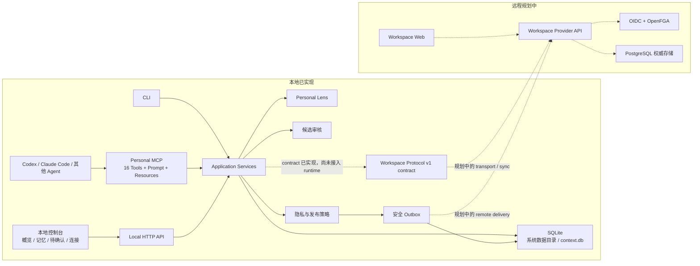

# 复利

复利是一个 local-first 上下文增长系统：让个人经验与项目事实在真实工作中持续沉淀，并让 Agent 在需要时按需查询。

## 复利要解决的问题

Agent 每次开始工作时，往往都要重新认识你、重新理解项目，还容易混淆过期规则、个人偏好和公共事实。

把所有历史一次性塞进提示词既昂贵，也会放大隐私与误判风险。

复利不是笔记软件，也不是要求人持续整理的知识库。它解决的是三个更具体的问题：

- **上下文会丢失。** 对话结束后，项目约束、历史替换和协作偏好很难自然延续。
- **事实会变化。** 新规则不是覆盖旧文本，而是带来源地替代旧事实；默认答案应当清楚，历史仍然可查。
- **个人与公共边界容易模糊。** 个人偏好、观察和私密内容不应因为与项目相关就自动进入公共空间。

复利把这些内容保存为有来源、有状态、有时间关系的记忆，并通过 Web、CLI 与 MCP 投影出当前任务真正需要的一小部分。

## 核心理念

- **本地优先。** 数据和主要能力在本机运行，离线时仍可记录、查询和审核。
- **在工作中增长。** Agent 和观察器从真实活动中沉淀上下文，人不需要维护另一套笔记流程。
- **按需查询。** Agent 只获取当前任务相关的少量信息，而不是读取全部记忆。
- **来源优先。** 事实保留来源、有效时间、替代关系和纠正记录，答案可以解释“为什么这样理解”。
- **个人信息默认留在本地。** 进入公共空间的内容必须遵循明确边界，当前保护范围见下文。
- **人保留判断权。** 满足公共分类条件的项目事实可以自动更新；个人内容留在个人空间，其他无法自动进入公共空间的工作内容进入待确认。人可以纠正个人记忆，也可以用新事实修正项目当前状态。

## 一个真实工作流

假设你正在和 Codex 修改一个项目的 API 配置。

1. Codex 先调用 `get_user_lens`，只读取与当前任务相关、符合预算的协作偏好。
2. 工作中出现新的 API 地址。Agent 通过 `remember_episode` 保存带来源的工作片段，而不是改一份无来源的长期提示词。
3. `personal` 来源或带明确个人措辞的内容进入个人空间。其余工作内容命中不确定标记时进入候选；未命中时，只有来源为 `prd`、`git`、`config` 或 `docs`、内容形似项目事实且指定了 target space，才自动进入公共空间，否则也进入候选。
4. 候选出现在本地控制台的“待确认”区。有明确 target space 时，你可以选择 `sync`、`personal_only` 或 `ignore`；缺少 target 时，当前 UI 不显示 `sync`，只能选择 `personal_only` 或 `ignore`。
5. 只有带 target space 的候选选择 `sync` 后，才会生成本地公共事实和安全 Outbox（待发送队列）记录；领域层会拒绝对无 target 候选执行 `sync`。
6. 下次 Agent 调用 `search_context` 或 `get_current_facts` 时，得到当前有效、带来源的事实；只有显式查询历史时才读取旧版本。

这条路径不依赖 Web 手工录入。Web 是本地运行状态、记忆、待确认项和连接关系的管理面。

## 当前实现状态

当前仓库已经交付正式本地运行时，以及未来共享端所需的协议契约。

| 能力 | 状态 | 说明 |
| --- | --- | --- |
| SQLite Personal Runtime | 已实现 | Web、CLI、MCP 共用同一应用服务与版本化 SQLite 存储 |
| 本地控制台 | 已实现 | 四区界面：概览、记忆、待确认、连接 |
| CLI | 已实现 | 一键本地 setup、空间、订阅、记忆、观察、查询、历史、候选审核与 legacy JSON 导入 |
| 本地 setup | 已实现 | 系统数据目录、SQLite 初始化、Agent 自动发现、配置备份、MCP 接入、后台启动与健康检查 |
| 标准 MCP | 已实现 | 官方 SDK、stdio transport、16 个 Tools、1 个 Prompt、3 个 Resources |
| Personal Lens | 已实现 | 显式记忆、观察、确认、纠正、历史、来源和预算化查询 |
| 候选审核 | 已实现 | 有 target 的候选可同步、只留个人或忽略；无 target 的候选只能只留个人或忽略 |
| 安全 Outbox | 已实现 | 发布 envelope 经过隐私策略检查并持久化，可重试；远程 delivery adapter 未实现 |
| Workspace Protocol v1 contract | 已实现 | transport-neutral 的严格解析、签名、查询、同步、发布与治理契约 |
| 远程 Workspace Provider 与同步 | 规划中 | PostgreSQL、OIDC、OpenFGA、远程 API、Workspace Web 和 local/remote sync 尚未实现 |

Workspace Protocol v1 contract 是已经可测试和复用的协议边界，不代表共享服务已经上线。

## 五分钟运行

当前是源码安装模式，仍需要 Node.js 24+。未来的桌面/二进制安装包会携带运行时，不要求用户预装 Node.js。

安装依赖：

```bash
npm install
```

设置复利：

```bash
node src/cli.js setup
```

命令会展示一次将要修改的内容，只询问一次确认，然后自动完成：

- 在系统数据目录初始化 SQLite 和个人空间。
- 自动发现 Codex、Claude Code，先备份已有配置，再通过各自 CLI 接入 MCP。
- 后台启动本地控制台并执行健康检查。

完成后直接打开命令输出的本地地址。Windows 默认数据目录是 `%LOCALAPPDATA%/Fuli`，macOS 是 `~/Library/Application Support/Fuli`，Linux 是 `$XDG_DATA_HOME/fuli` 或 `~/.local/share/fuli`。

想直接使用 `fuli` 命令，可以在源码目录执行一次：

```bash
npm link
fuli setup
```

自动化或开发环境可以跳过交互、Agent 接入或后台启动：

```bash
node src/cli.js setup --yes --skip-agents --no-start --data-dir ./tmp/fuli
```

在另一个终端写入并查询一条带来源的项目事实：

```bash
node src/cli.js remember 我 --target 工作 --source-kind prd --text "api_base: https://api.example.com"
node src/cli.js search 我 api_base
```

查看 MCP 工具清单，或启动 stdio server 供 MCP 客户端连接：

```bash
node src/mcp-server.js --tools
node src/mcp-server.js
```

## Codex / Claude Code 接入

`fuli setup` 会自动发现本机已安装的 Codex 和 Claude Code，并通过它们自己的 MCP 管理命令完成用户级接入；已有配置会在修改前备份。下面只保留手工接入作为排障和开发参考。

手工配置时，把 setup 输出的数据库绝对路径填入 `/ABSOLUTE/PATH/TO/FULI_DATA/context.db`，确保 Codex、Claude Code、Web 和 CLI 读写同一份数据。

### Codex

在项目的 `.codex/config.toml` 中加入：

```toml
[mcp_servers.fuli]
command = "node"
args = [
  "/ABSOLUTE/PATH/TO/compound-interest/src/mcp-server.js",
  "--db",
  "/ABSOLUTE/PATH/TO/FULI_DATA/context.db",
  "--personal-space",
  "我"
]
```

### Claude Code

在项目的 `.mcp.json` 中加入：

```json
{
  "mcpServers": {
    "fuli": {
      "command": "node",
      "args": [
        "/ABSOLUTE/PATH/TO/compound-interest/src/mcp-server.js",
        "--db",
        "/ABSOLUTE/PATH/TO/FULI_DATA/context.db",
        "--personal-space",
        "我"
      ]
    }
  }
}
```

Codex 和 Claude Code 的项目级 MCP 配置需要用户信任或批准项目后才会启用。

配置完成后，Agent 应优先使用 `get_user_lens`、`search_context` 等窄工具按需查询。不要把数据库文件或整个个人空间作为上下文直接读取。

## 系统架构



实线表示当前生产运行路径；虚线表示规划中的远程路径，或已经实现但尚未接入生产 runtime 的 contract。

## 个人空间、工作空间与数据流

### 个人空间

个人空间保存在本地，承载 Personal Lens、个人事实、观察、候选、订阅和来源信息。它可以表达：

- 已确认的身份、协作偏好、长期边界和工作方法。
- Agent 观察到但尚未确认的模式。
- 已被纠正、否定或废弃的历史认知。
- 不适合公开的个人上下文。

Personal Lens 是个人空间面向 Agent 的安全投影，不是静态用户档案，也不是个人空间全量副本。

### 工作空间

当前 runtime 支持 SQLite 中的本地公共空间，fresh database 默认创建名为 `工作` 的空间。它保存有来源、可供 Agent 查询的项目事实，并与个人空间通过订阅关系连接。

### 数据流

```text
工作活动或明确陈述
  -> Episode（保留来源）
  -> 分类与敏感内容检查
     -> personal 来源或明确个人措辞：个人事实
     -> 其余内容命中不确定标记：待确认候选
     -> 未命中不确定标记，并满足公共来源白名单 + 事实形态 + target space：
        本地公共事实 + 安全 Outbox
     -> 未命中不确定标记，但缺少 target、来源不在白名单或内容不像项目事实：
        待确认候选
  -> 候选有 target：人决定同步 / 只留个人 / 忽略
  -> 候选无 target：人决定只留个人 / 忽略；领域层拒绝同步
  -> Personal Lens：人可事后纠正、reject 或 deprecate
  -> 本地公共事实：写入新值或明确 replacement 后保留演化历史
  -> Agent 按任务查询有界投影
```

当前数据边界：

- **路由条件：** `personal` 来源或明确个人措辞进入个人空间。其余工作内容命中不确定标记时进入候选；未命中时，只有来源属于 `prd`、`git`、`config`、`docs`，内容形似项目事实，并且存在 target space，才自动写入本地公共空间并生成 Outbox。缺少 target、来源不在公共白名单或内容不像项目事实时也进入候选。
- **公共事实更新：** 对于唯一 `has_*` 参数，向同一 predicate 写入新值会使旧值失效并记录 replacement 关系；显式 `替代: old => new` 同样建立 replacement。
- **公共治理：** 当前 Web、CLI 和 MCP 没有公共事实 `reject/deprecate` 入口，完整公共治理属于远程 Workspace Provider 规划。
- **敏感内容：** 当前实现会拒绝检测器识别出的凭据、密钥和令牌模式，带明确个人措辞的内容倾向个人空间，但规则分类器不是完整 DLP。用户仍应避免把敏感个人信息作为项目事实输入。
- **最小披露：** 订阅关系不会复制个人空间的全量内容。未来远程连接仍以只发送经过策略处理、带来源的 publication proposal 为原则，并由服务端再次校验。

## 记忆演化、来源和人的判断权

复利把记忆看作可追溯的演化链，而不是最后一次写入覆盖前文。

- **Episode** 保存原始工作片段与来源，是事实的证据入口。
- **Fact** 保存 Agent 可查询的结构化事实，并区分当前与历史状态。
- **替代与纠正** 保留旧事实、时间和来源；Personal Lens 支持 correction、`reject` 和 `deprecate`。对于唯一 `has_*` 项目参数，同一 predicate 的新值会使旧值失效并记录 replacement 关系；显式 `替代: old => new` 同样建立 replacement。默认查询只返回当前有效版本。
- **Personal Lens 状态** 包括 `confirmed`、`observed`、`suggested`、`rejected` 和 `deprecated`。

Agent 可以提交个人观察；Personal Lens 中的 inferred observation 进入 `suggested` 状态，不会自动升级为 `confirmed`。工作上下文先将 `personal` 来源或明确个人措辞路由到个人空间；其余内容命中不确定标记，或缺少 target、来源不在 `prd/git/config/docs` 公共白名单、内容不像项目事实时，进入 candidate queue。人可以纠正、`reject` 或 `deprecate` Personal Lens 事实；项目事实的当前值和 replacement 历史由上述公共更新规则维护。

用户可以追问来源、纠正 Personal Lens、查看历史，或处理候选：有 target 时可同步、只留个人或忽略，无 target 时只能只留个人或忽略。当前实现会保留 Personal Lens 具体事实的 `rejected`、`deprecated` 和 correction 历史，并将它们排除在默认当前 Lens 之外；对语义改写后的相似内容进行防复活仍在规划中。

## Web / CLI / MCP 参考

### Web：本地管理面

```bash
node src/server.js
```

默认地址是 `http://127.0.0.1:5173`，默认只在 localhost 提供服务。可指定数据库、个人空间和端口：

```bash
node src/server.js --db /ABSOLUTE/PATH/TO/FULI_DATA/context.db --personal-space 我 --port 5173
```

本地控制台包含四个区域：

- **概览：** runtime 状态、记忆数量、待确认数量、空间、订阅和最近变化。
- **记忆：** Personal Lens、当前事实和演化历史。
- **待确认：** 候选观察、Git diff 检查、刷新与人工决定。
- **连接：** 本地空间、订阅关系及其管理。

Web 负责查看和管理本地 runtime，不是主要知识输入入口，也不是传统笔记编辑器。

### CLI

查看完整帮助：

```bash
node src/cli.js --help
```

当前命令：

```text
setup [--yes] [--data-dir DIR] [--personal-space NAME] [--port PORT] [--skip-agents] [--no-start]
space create NAME --kind personal|public
subscribe PERSONAL_SPACE PUBLIC_SPACE
remember PERSONAL_SPACE --target SPACE --source-kind KIND --text TEXT
observe PERSONAL_SPACE --target SPACE
search PERSONAL_SPACE QUERY
timeline SPACE SUBJECT
rules SPACE
history SPACE PREDICATE
context PERSONAL_SPACE SPACE QUERY
candidates PERSONAL_SPACE
candidate CANDIDATE_ID sync|personal_only|ignore
migrate --from LEGACY_JSON --to SQLITE_DB
```

`sync` 只适用于带 target space 的候选。无 target 候选在当前 UI 中没有 `sync` 操作，直接调用 CLI 或 MCP 请求同步也会被领域层拒绝。

`--db` 和 `--personal-space` 是 global flags，**必须写在 command 前面**：

```bash
node src/cli.js --db /ABSOLUTE/PATH/TO/FULI_DATA/context.db --personal-space 我 search 我 api_base
```

command 后出现的同名字面 token 属于该 command，不会被 global option parser 读取。

运行时配置优先级为 CLI global flags、环境变量、默认值：

| 配置 | 环境变量 | 默认值 |
| --- | --- | --- |
| SQLite 数据库 | `FULI_DB_PATH` | 系统 Fuli 数据目录下的 `context.db` |
| 个人空间名称 | `FULI_PERSONAL_SPACE` | `我` |

JSON 只保留为 legacy import 格式，不是正式运行数据库。一次性导入使用已实现的 `migrate` 命令；源文件不会被修改。

### MCP

启动真实的 MCP stdio server：

```bash
node src/mcp-server.js --db /ABSOLUTE/PATH/TO/FULI_DATA/context.db --personal-space 我
```

当前恰好暴露 16 个 Tools：

| 领域 | Tools |
| --- | --- |
| 工作上下文 | `remember_episode`, `search_context`, `get_current_facts`, `get_timeline` |
| 项目规则与历史 | `get_project_rules`, `get_fact_history`, `get_context_pack`, `observe_git_diff` |
| 候选审核 | `list_candidates`, `decide_candidate` |
| Personal Lens 写入 | `remember_user_fact`, `submit_user_observation`, `correct_user_fact`, `confirm_observation` |
| Personal Lens 查询 | `get_user_lens`, `search_user_context` |

另有一个 Prompt：

- `get_to_know_me`：渐进、一次一问、可以跳过的用户偏好访谈。

以及三个 Resources：

- `fuli://lens/current`：当前安全 Personal Lens。
- `fuli://lens/history`：有界的 Lens 演化历史。
- `fuli://spaces/subscribed`：当前个人空间订阅的公共空间。

列出 registry 或单次调用工具：

```bash
node src/mcp-server.js --tools
node src/mcp-server.js --db /ABSOLUTE/PATH/TO/FULI_DATA/context.db --call get_user_lens --input "{\"task\":\"实现当前功能\",\"budget\":2000}"
```

MCP 返回的是有界投影，不暴露 store、snapshot、数据库路径或候选原始私密正文。

## 代码结构与本地开发

主要模块：

```text
src/
  app/                 应用服务、bootstrap 与统一错误边界
  agent/               Agent 查询策略与安全投影
  setup/               本地安装、Agent 接入与 Runtime 生命周期
  lens/                Personal Lens 写入、纠正、检索与 Resources
  publication/         发布策略、envelope 与持久化 Outbox
  storage/             Store Port、SQLite、迁移与 legacy JSON 导入
  workspace-protocol/  Workspace Protocol v1 contract
  cli.js               CLI 入口
  mcp-server.js        MCP stdio 入口
  server.js            本地 HTTP 与 Web 入口
web/                   四区本地控制台
test/                  Node.js 单元、集成、边界与协议测试
```

本地开发要求 Node.js 24+：

```bash
npm install
npm test
```

三个产品入口共享 [`src/app/create-application.js`](src/app/create-application.js) 中的应用服务。正式本地存储是 [`src/storage/sqlite-store.js`](src/storage/sqlite-store.js)；`FileStore` 仅用于测试 adapter。

修改运行时边界时，重点验证隐私拒绝、候选决定重放、Outbox、MCP structured payload、SQLite 并发和 Workspace Protocol strict parser。

## 规划中能力

以下能力尚未实现，不应作为当前部署命令执行：

- 携带 Node.js 运行时的桌面/二进制安装包，以及操作系统级开机自启和升级回滚。
- `fuli deploy`：规划中的自托管 Workspace Provider 编排入口。
- 远程 Workspace Provider、Workspace Web，以及公共事实 `reject/deprecate`、proposal 决策等完整公共治理入口。
- PostgreSQL 共享事实权威存储。
- OIDC 身份认证与 OpenFGA 授权。
- Personal Runtime 的 Provider Registry、远程查询与 local/remote sync。
- 安全 Outbox 到 v1 signed publication proposal 的 delivery adapter。

`fuli setup` 已可在源码安装模式使用；`fuli deploy` 目前不可用。

## 设计文档与许可证

- [README 重写设计](docs/superpowers/specs/2026-07-12-readme-redesign.md)
- [联邦式 Workspace Provider 设计](docs/superpowers/specs/2026-07-11-federated-workspace-provider-design.md)
- [复利整体设计](docs/superpowers/specs/2026-07-10-compound-interest-design.md)

项目在 [`package.json`](package.json) 中声明为 Apache-2.0 许可证。
