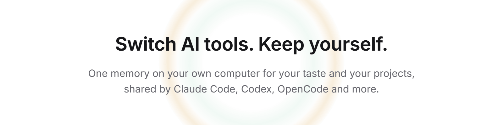
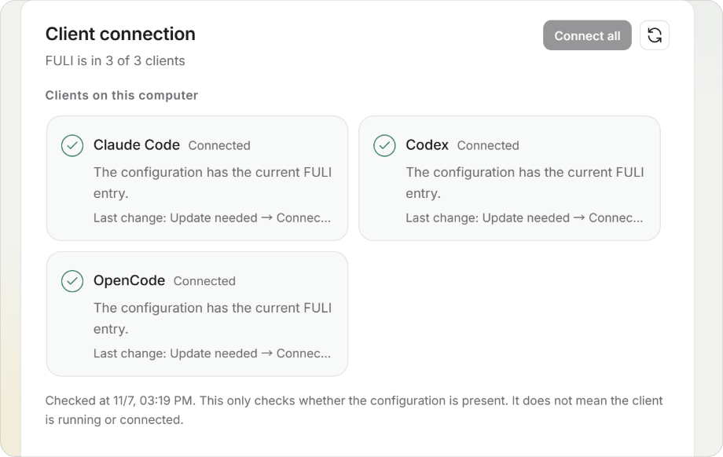
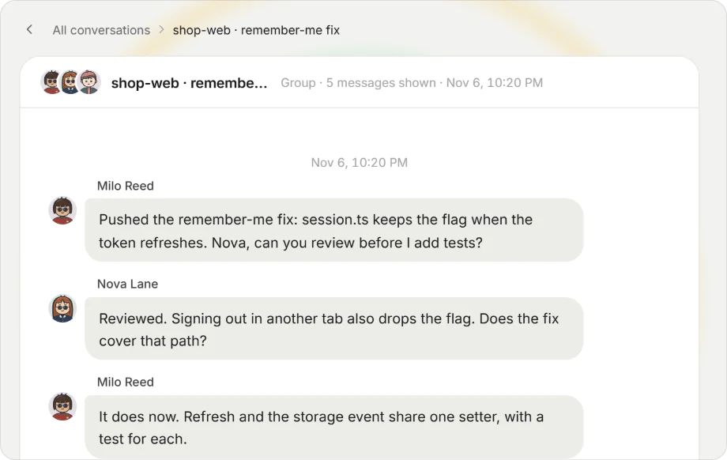
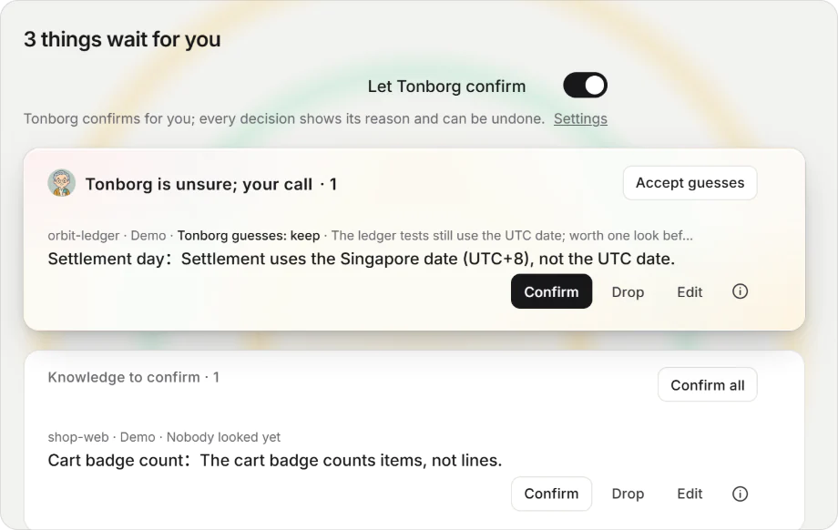
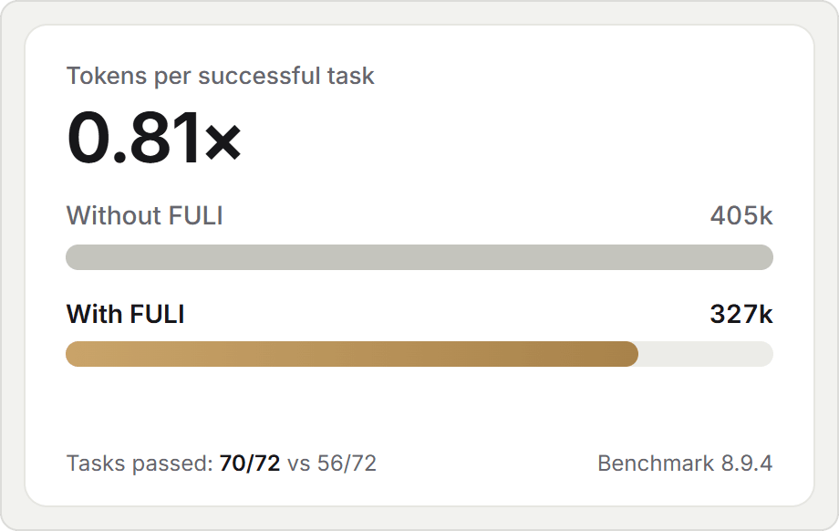
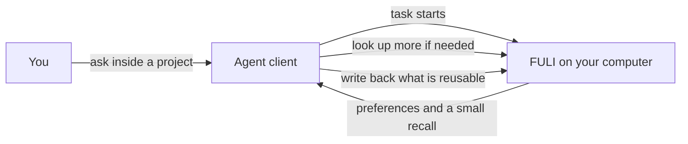
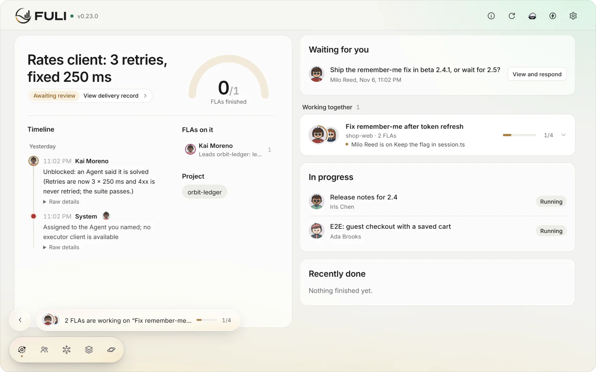

<p align="center">
  <picture>
    <source media="(prefers-color-scheme: dark)" srcset="brand/svg/lockup/fuli-lockup-bilingual-horizontal-dark.svg" />
    
  </picture>
</p>

<p align="center">
  <picture>
    <source media="(prefers-color-scheme: dark)" srcset="docs/readme/hero-en-dark.webp" />
    
  </picture>
</p>

<p align="center">FULI is a plugin that lets your tasks move across all your Agent clients: Claude Code, Codex, OpenCode… They share one memory, one taste and one FLA team, so you use whichever fits and switch without explaining everything again. It doesn't replace your clients or change what you set up: your models, subscriptions, sessions and settings stay as they are. FULI plugs in as its own entries only, and removing it from a client in the console, or uninstalling FULI, takes those entries out again.</p>


<p align="center">
  English · <a href="README.zh-CN.md">简体中文</a> · <a href="https://有点.意思.com/fuli/">Website</a> · <a href="https://github.com/JevonsCode/fuli/releases/latest">Download</a>
</p>

<p align="center">
  <a href="https://github.com/JevonsCode/fuli/releases/latest"></a>
  <a href="https://www.npmjs.com/package/fuli-context"></a>
  <a href="https://github.com/JevonsCode/fuli/releases"></a>
  <a href="https://www.npmjs.com/package/fuli-context"></a>
  <a href="LICENSE"></a>
</p>

<h3 align="left">Automate everything that can be automated, and hand the execution to your FLAs. You make the calls and lead the way: take your FLA crew through the hard parts, or go grab a coffee and enjoy the compound interest of your own experience.</h3>

<p align="left">Project profiles and FLA hiring run on their own if you'd rather not think about them; your only job is to set the direction. FLAs carry context and tools across every Agent client, and both top-tier and lighter models pull their weight here.</p>


Each task gets only the small slice it needs. Your judgment and experience keep adding up, so FULI
knows you better the more you use it. That is the compound interest. Little by little, what your
AI makes starts to carry your taste.

## What FULI does

<table>
  <tr>
    <td width="50%" valign="top">
      
      <h3 align="center">One memory for every client</h3>
      Connect Claude Code, Codex, OpenCode or Cursor with one click. A rule you stated in one of them is there in the others.
    </td>
    <td width="50%" valign="top">
      
      <h3 align="center">A team of FLAs, talking at a roundtable</h3>
      Each project gets a lead Agent (an FLA) with a name, a job and its own working memory; several FLAs form a group when the work needs it. They review, test and hand work over to each other in the roundtable, and you can read every turn.
    </td>
  </tr>
  <tr>
    <td width="50%" valign="top">
      
      <h3 align="center"> Tonborg confirms for you</h3>
      New knowledge waits for a yes. Switch on Tonborg and it confirms everyday items by your preferences, asks you when it is unsure, writes down each reason, and learns from a thumbs up or down.
    </td>
    <td width="50%" valign="top">
      
      <h3 align="center">Fewer tokens per finished task</h3>
      Measured for the upcoming 0.25.0: a successful task with FULI takes 0.81× the tokens of the same task without it, and 70 of 72 tasks pass. The saving comes from facts that live in your words, not in the code.
    </td>
  </tr>
</table>

Four FLAs come built in:

<table>
  <tr>
    <td width="25%" align="center" valign="top">
      <br />
      <b>Jefa</b> is your project manager.
    </td>
    <td width="25%" align="center" valign="top">
      <br />
      <b>Bole</b> hires FLAs and staffs each project.
    </td>
    <td width="25%" align="center" valign="top">
      <br />
      <b>Tonborg</b> confirms for you and recommends clients and models.
    </td>
    <td width="25%" align="center" valign="top">
      <br />
      <b>Astro</b> takes conversations that belong to no project yet.
    </td>
  </tr>
</table>

## How it works


```mermaid
flowchart LR
    U[You] -->|ask inside a project| A[Agent client]
    A -->|task starts| F[FULI on your computer]
    F -->|preferences and a small recall| A
    A -->|look up more if needed| F
    A -->|write back what is reusable| F
```

A task starts with the preferences in effect and a few related facts. The Agent looks up the rest
when it needs it, and at the end writes back only what the next task can reuse.

## Install

FULI runs a small service and a console on your own computer.

**Desktop client (recommended).** Download from the [latest release](https://github.com/JevonsCode/fuli/releases/latest):

| System | File |
| --- | --- |
| Windows | `FULI-Setup-<version>.exe`. No terminal and no administrator rights. |
| macOS (Apple silicon, 13.5 or later) | `fuli-macos-arm64-<version>.dmg`. Drag FULI onto Applications. |

On first launch FULI finds the AI clients on this computer and connects each with one click. The
installers are not signed yet, so each system holds FULI back once; [Install and run](docs/install.md)
shows the two clicks that let it through.

**Servers, VMs and the cloud.** Without a desktop, and on Intel Macs and Linux, install with npm
(Node.js 24.12 or later):

```bash
npm install --global fuli-context
fuli setup
fuli open
```

`fuli setup` shows its plan and changes nothing until you confirm.

## The console

<p align="center">
  
</p>

The console opens on what matters now: questions waiting for you, the FLAs at work and what they
finished. Everything runs on `127.0.0.1`; there is no account and no sign-in.

## FAQ

<details>
<summary><b>Where is my data?</b></summary>

On your computer. Your personal graph and conversation records stay local. External knowledge
(Notion, Lark, MCP or RAG sources) is read-only: FULI never writes back.
</details>

<details>
<summary><b>Which clients work with FULI?</b></summary>

Claude Code, Codex, OpenCode, Cursor and Claude Desktop connect from the console with one click.
Other MCP clients run `fuli connect` for a standard configuration.
</details>

<details>
<summary><b>How do I call one of my FLAs?</b></summary>

Start a message with `#FLA` and its name. In Claude Code, OpenCode and Cursor you can also type
`/fla` and pick one from the menu; in the Codex app, type `/prompts:fla`. Turn the menu off in Settings › Clients.
</details>

<details>
<summary><b>How does FULI save tokens?</b></summary>

A session starts with only the preferences in effect and a few related facts; the Agent looks up
the rest when it needs it. Facts that only you know, such as a sandbox URL you mentioned once,
come back later without a search through the code. The numbers are in the
[benchmark](FULI_ALIGNMENT_BENCHMARK.md) (section 8.9.4).
</details>

<details>
<summary><b>Do the built-in FLAs cost extra?</b></summary>

By default the built-in FLAs work inside your client's session. Only when you connect a model for
them do they use their own model, so nothing spends money behind your back.
</details>

<details>
<summary><b>How do I take FULI out of a client?</b></summary>

In the console, open Settings › Clients and choose Remove for that client. `fuli uninstall` and the
Windows uninstaller do the same for every connected client. FULI takes out only its own entries
(the MCP server, hooks, Skills and its permission lines), backs up each file first, and keeps a
Skill you edited yourself. Your FULI data stays until you delete it. On macOS, remove the clients
in the console before you move FULI.app to the Trash: the Trash alone leaves those entries in place.
</details>

<details>
<summary><b>I installed FULI with npm before. Is it installed twice now?</b></summary>

The program is, your data is not: both use the same data folder. When the desktop client starts, it runs the one FULI
service and points your connected clients at itself. The console then offers to remove the npm copy with one click;
until it is removed, a bare `fl` in a terminal is still the npm version.
[Details](docs/install.md#already-installed-with-npm)
</details>

<details>
<summary><b>Who decides what FULI keeps?</b></summary>

You do: AI looks things up and does the work, and humans retain final authority. Each task ends
with one check that keeps only reusable knowledge. A preference an Agent guessed counts once you,
or  Tonborg within the autonomy you set, confirm it. Older answers stay in the history with their
source and reason.
</details>

## Learn more

| Topic | Read |
| --- | --- |
| Install details, CLI commands, ports | [Install and run](docs/install.md) |
| Principles and what is stored where | [How FULI works](docs/how-it-works.md) |
| Connecting each client | [Connect a client](docs/client-connections.md) |
| Skills, hooks and MCP tools | [Agent integrations](docs/agent-tools.md) |
| Notion, Lark and other knowledge bases | [External knowledge](docs/external-knowledge.md) |
|  Tonborg and autonomy | [Judgment and autonomy](docs/judgment-and-autonomy.md) |
| The roundtable | [Roundtable](docs/agent-roundtable.md) |
| What is proven so far | [Capabilities and limits](docs/capabilities-and-limits.md) · [Measured report](https://有点.意思.com/fuli/report/en/) |
| Running the source | [Develop and verify](docs/development.md) · [Contributing](CONTRIBUTING.md) |

The FULI mark and wordmarks come from the [FULI 复利 brand system](https://www.figma.com/community/file/1698659778015746085); see [`brand/README.md`](brand/README.md).
Licensed under [Apache-2.0](LICENSE).
