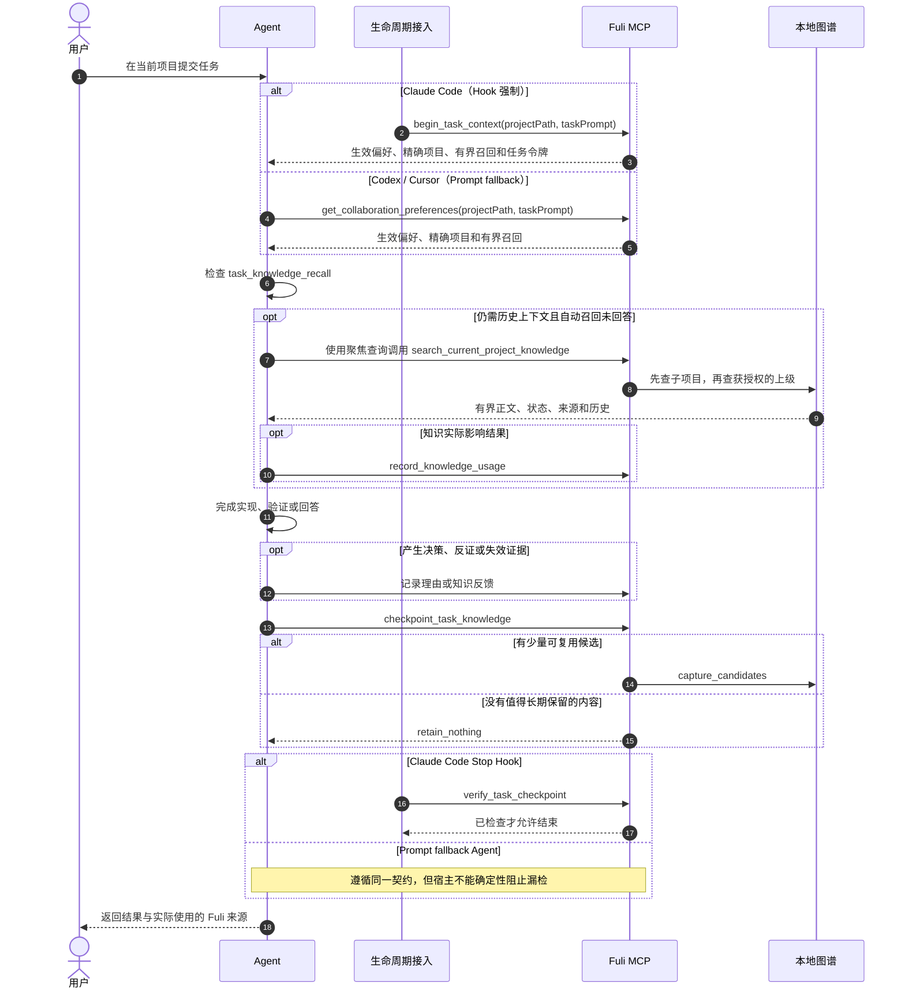

<p align="center">
  
</p>

<h1 align="center">复利（Fuli）</h1>

<p align="center">
  <a href="README.md">English</a> · 简体中文
</p>

<p align="center">
  <a href="https://www.npmjs.com/package/fuli-context"></a>
  <a href="https://www.npmjs.com/package/fuli-context"></a>
  <a href="LICENSE"></a>
</p>

复利是一个面向 AI Agent 的本地优先协作关系图谱。人与 Agent 的持续对话会逐步形成项目、
人物、决定、偏好、行为步骤和证据之间的关系；关系节点可以指向 Fuli 本地内容，也可以连接
外部知识库或其他数据源。Codex、Claude Code 和 Cursor 因而能在后续任务中复用已经形成的
品味、个性、判断偏好与协作方法。

复利不是聊天记录仓库，也不是以“收集更多文档”为目标的知识库，更不试图建立一个替代人的
“人格模型”。AI 负责检索、提醒、归纳和执行；人始终保留最终判断权。

## npm 包

| 包 | 状态 | 用途 |
| --- | --- | --- |
| [`fuli-context`](https://www.npmjs.com/package/fuli-context) | 已发布 | 个人版；个人知识、图数据库和管理界面都在本机运行 |
| Fuli Server npm 包 | 开发中 | 面向团队共享场景的独立服务端；目前尚未发布 |

目前唯一可用的 npm 包是个人版 `fuli-context`。团队共享层不会包含个人品味、个性或判断偏好。

## 项目理念

### 1. 衡量复用价值，而不是知识数量

复利的核心问题是：

> 如果没有 Fuli，Agent 是否需要重新学习一条已经确认、仍然有效且与当前任务相关的信息？

节点数、对话数和图谱规模不是成功指标。真正需要验证的是：历史资产能否在正确的项目、时间
和权威边界内被再次使用，并减少重复解释、修正和返工。

### 2. 每个任务都检查价值，但不强迫每个任务沉淀

一次任务可能产生：

- 可复用知识：API 约定、Runbook、发布方式或项目约束；
- 经验：为什么某个做法有效或失败；
- 决策轨迹：候选方案、人的选择、理由和后续验证；
- 判断辅助：偏好、原则、品味或个性倾向。

也可能只有临时输出、猜测或一次性选择。此时正确结果是 `retain_nothing`。复利要求每个任务
结束前做一次知识价值检查，并不是把每次聊天都变成长久记忆。

### 3. 人的权威高于 Agent 的重复判断

AI 可以发现候选、指出冲突、建议公共化，也可以在得到授权后处理延迟冲突；它不能仅凭语义
相似、重复出现或自己的判断伪造人工确认。公共知识提升和有风险的项目写入必须先预览，再由
明确的人类选择触发一次性、原子执行。

### 4. 先组装上下文，再按需取证

Fuli 不会在会话开始时把全部历史塞给模型。入口阶段始终加载当前任务实际生效的个人全局偏好、
精确项目偏好和显式允许传播的上级项目偏好；当任务信号表明可能需要稳定的历史事实、方法、
网址、决策、发布、部署或认证 Runbook 时，同一步骤还会在精确项目及其获授权知识来源中执行
一次小规模、有界的自动召回。
需要更多证据时，Agent 再使用聚焦查询按需检索。只有真正影响回答、实现或决策的知识才记录为
一次使用，单纯检索不会增加权重。

### 5. 保留知识演化，而不是覆盖历史

旧方案可能在当时正确，后来因条件变化被替代。Fuli 保存来源、确认权威、时间、理由、修订、
替代和负面证据，让 Agent 能解释“现在应该用什么”以及“为什么过去曾经不同”。负面反馈会
降低相关内容的排序或触发复核，但不会静默抹掉历史。

### 6. 公共知识归属上级，项目差异留在子项目

例如，酒店和机票项目可以只保存自己的 PRD、配置和领域规则，把共同的本地运行、Mock、测试
和发布方式收敛到活动平台项目：

```text
活动平台（父项目：共享 Runbook）
├── 酒店项目（子项目：酒店 PRD / 配置 / 覆盖项）
└── 机票项目（子项目：机票 PRD / 配置 / 覆盖项）
```

Agent 在酒店项目工作时先搜索酒店本地知识，再沿显式的 `PART_OF` 或
`USES_KNOWLEDGE_FROM` 关系向上搜索允许继承的知识，最多两跳。同稳定键的子项目内容覆盖
父项目内容。项目级个人偏好默认只在精确项目生效；只有显式设置为 `descendants` 或
`selected_projects` 的偏好才可沿同样的授权关系传播，并返回来源项目、路径和距离。多个同层
父项目冲突时必须交给人判断，不能靠权重选胜者。普通 `RELATED_TO` 不会自动扩大作用域；
搜索结果只返回一次性只读扩展建议，由 Agent 先询问用户。

多个子项目中相似的内容只会形成公共化候选。跨无共同父级项目出现的共同偏好也只能形成个人
全局候选，并完整保留每个项目的原文、限定词和来源。当前聚类是词法启发式信号，不是语义
等价证明；必须由人选择内容、作用域和理由后，才能生效。

### 7. 本地优先，公开层不包含个人模型

个人图谱默认留在本机。Fuli 保存结构化、可复用的知识，不保存整段会话、凭据、临时日志或
原始命令输出。团队共享层只承载经过确认、具有上下文和来源的项目或领域知识，不包含个人的
品味、个性和判断偏好。

## 实际怎么用：分类、作用域、项目识别与取回

### 先判断存什么，再判断存在哪里

“内容类型”和“生效范围”是两个独立维度。前三类是个人协作偏好，会带有
`profileAspect`；项目事实不带 `profileAspect`，也不会出现在“个人偏好”页中。

| 类型 | 应该存什么 | 例子 |
| --- | --- | --- |
| 品味 `taste` | 用户明确喜欢或排斥的结果、风格与质量方向，适用于界面、文案、产品、架构和工程结果 | “页面少用大渐变，不要卡片套卡片” |
| 个性 `personality` | 用户明确自我描述、并且预计长期稳定的工作或协作特点 | “我习惯直接沟通，希望 Agent 主动推进” |
| 判断偏好 `judgment_preference` | 面对取舍时的决策条件、优先级、风险倾向和操作边界 | “方向性歧义先讨论；未明确时禁止 `git push`” |
| 项目知识 | 可复用的客观项目事实、术语、需求、路由、API、架构、决策理由和 Runbook | “Fuli 的 npm 发布由 GitHub Release 触发” |

可以用四个问题快速分类：它描述的是“想要什么结果”时存品味；描述“我是怎样长期协作的”时
存个性；描述“遇到取舍时怎么决定”时存判断偏好；描述“这个系统客观上如何工作”时存项目
知识。一次性命令、临时输出、未经验证的猜测、原始聊天和凭据都不沉淀。

“个性”不是所有个人信息的兜底分类。只有用户明确给出的稳定自我描述可以直接带着人工依据
确认；Agent 仅从一次行为推断出的个性必须先保持 `pending`，不能伪装成人工确认。因此
`/preferences` 的“个性”为空，通常表示当前范围内还没有符合这个标准的条目，而不是沉淀
失败。像“文案简洁”更可能是品味，“未授权不推送”更可能是判断偏好。需要明确沉淀时，可以
直接说：`这是我的长期协作个性，请作为个人全局偏好保存：我习惯直接沟通。` Agent 推断的
候选可在 `/preferences` 或 `/flreview` 中由用户确认、纠正或失效。

### 全局、项目级和公共层

| 范围 | 何时使用 | 写入关键字段 | 取回规则 |
| --- | --- | --- | --- |
| 个人全局偏好 | 在无关项目中也应该保持不变 | `targetKind: "personal"`，不传 `personalProjectId`，设置 `profileAspect` | 每个任务都加载 |
| 项目级个人偏好 | 协作方式属于一个项目或项目族 | 同上，同时传精确的 `personalProjectId`；默认 `local_only`，不向子项目继承；需传播时显式使用 `descendants` 或 `selected_projects` | 精确项目优先；仅按显式继承模式沿获授权关系传播，冲突不按分数自动裁决 |
| 项目知识 | 事实只属于一个项目，或应由某个上级项目统一维护 | `targetKind: "personal"`，传 `personalProjectId`，不设置 `profileAspect` | 先查当前项目，再沿获授权的 `PART_OF` / `USES_KNOWLEDGE_FROM` 最多向上两跳 |
| 团队公共知识 | 经人工确认、确实需要共享的项目或领域知识 | `targetKind: "project"`，并经过预览/审核 | 只有明确订阅或选择的公共项目可见；个人偏好永不进入这一层 |

判断作用域时问一句：**换到完全无关的项目，这条协作偏好还应该改变 Agent 的行为吗？**
“是”就存个人全局；“否，只在 Fuli 项目或项目族”就存项目级偏好，并明确是否允许向子项目
传播。客观项目事实不要因为多个项目都可能用到就改存个人全局；应放在明确的上级或知识源
项目，再建立有方向的授权关系。全局和项目级存在同一 `attributes.preferenceKey` 时，
确认权威必须先裁决；权威相同时才由精确项目版本覆盖全局版本。

### Fuli 怎么识别当前项目

Fuli 只匹配已经登记在“个人项目”中的稳定 `project_id`，不根据目录内容做模糊猜测。通常让
`project_id` 与仓库目录名一致，例如仓库 `/workspace/fuli` 对应项目 `fuli`。标准调用只传
当前工作目录，解析顺序如下：

1. 向上找到最近的 Git 仓库根；仓库目录名与已登记 `project_id` 完全相同时命中。
2. 如果当前目录是 Codex worktree，从 `.git` 指向的原始仓库恢复项目 ID。
3. 当前目录名与已登记项目 ID 完全相同时命中。
4. 如果当前目录是工作区根，并且正好只有一个已登记的直接子目录带 `.git`、`package.json`、
   `pyproject.toml`、`Cargo.toml` 或 `go.mod`，命中这个唯一子项目。
5. 多个候选返回 `ambiguous`，没有候选返回 `unmatched`；两种情况都不会应用项目级偏好，也
   不会猜一个项目。

第一次进入尚未登记、但身份明确的仓库时，已安装的沉淀 Skill 可以在首次项目级写入前通过
`upsert_personal_project` 创建最小的本机私有项目；它不会自动创建或订阅公共项目。若工作区
有多个候选，应进入精确项目目录运行 Agent，或先在“个人项目”中明确选择和登记。

### Agent 什么时候调用什么

正常使用时，不需要手工调用 MCP 工具：在项目目录中向 Agent 提任务即可。Claude Code Hook
调用 `begin_task_context`；Codex 和 Cursor 的 Prompt fallback 在每个任务开始调用一次：

```json
{
  "tool": "get_collaboration_preferences",
  "arguments": {
    "projectPath": "/workspace/fuli",
    "taskPrompt": "修复 npm 发布流程，并沿用这个项目已有的发布约定"
  }
}
```

命中后，返回值中的关键部分类似：

```json
{
  "context": {
    "personal_project_id": "fuli",
    "project_resolution": {
      "status": "matched",
      "basis": "repository_root",
      "personal_project_id": "fuli"
    }
  },
  "effective_preferences": ["个人全局偏好 + fuli 的精确项目偏好"]
}
```

入口返回的 `task_knowledge_recall` 没有回答稳定项目事实时，再用 1 至 4 条面向动作、产物、目标
系统或标识符的短查询检索；不要把整段用户请求原样当成唯一查询：

```json
{
  "tool": "search_current_project_knowledge",
  "arguments": {
    "projectPath": "/workspace/fuli",
    "queries": ["npm 发布 Runbook", "GitHub Release 触发条件"],
    "includePending": false
  }
}
```

任务结束时，Hook 模式调用 `checkpoint_task_knowledge`：只有少量、可复用且有证据的内容才用
`capture_candidates`；否则使用 `retain_nothing`。Prompt fallback Agent 遵守相同判断标准，并
通过 `capture_session_knowledge` 写入。写个人偏好时设置正确的 `profileAspect` 和稳定的
`attributes.preferenceKey`；写项目事实时不设置 `profileAspect`。如果“设置”中的自动沉淀已
关闭，写入会返回 `capture_disabled`，不会产生任何类别的条目。

本地可先运行下面两个契约测试，验证 README 说明和项目路径解析仍与实现一致：

```bash
npm run test:node -- test/acceptance-docs.test.js test/project-path-context.test.js
```

## Agent 交互时序

下面是日常任务的简化时序。更完整的项目继承、使用计数、写入预览和来源标记流程见
[智能体调用时序图](acceptance/智能体调用时序图.md)。



## 外部知识库只读接入

一个第三方知识库连接可以同时绑定到一个或多个已经存在的个人项目，不需要授予 Fuli 对源系统
的写权限。每个目标项目独立保存检索模式、同步游标和错误状态；连接页支持多选绑定、连通性
检查、手动同步、解绑，以及按项目设置冲突处理开关。

| 连接器 | 读取路径 | 当前边界 |
| --- | --- | --- |
| MCP | Resources `list/read`；可配置 `search` / `fetch` 工具 | 默认方式；HTTPS、回环 HTTP 或 stdio |
| Notion | 页面 Markdown 与 Data Source 查询 | 当前 `2026-03-11` API；必须明确页面或数据源 ID |
| 飞书 / Lark | Wiki 节点、搜索与 Docx 纯文本 | 当前只提取 Docx；搜索可能需要 user access token |
| RAG Retrieval API | Dify 外部知识库兼容检索协议 | 仅实时；适合 Dify 兼容端点或适配后的 RAGFlow 等系统 |
| 可信自定义代码 | 本地 ESM `sync` / `retrieve` 契约 | 用户显式安装的可信代码，不是沙箱 |

<a id="connect-external-knowledge"></a>

### 给项目连接一个或多个知识库

同一个个人项目可以拥有多个独立知识库绑定，同一个知识库连接也可以绑定多个个人项目。每次
提交表单都会新增一个连接，不会覆盖已有连接；连接来源只保存一次，项目目标分别保存检索模式、
同步状态和错误。已有连接可用“绑定项目”继续增删目标。

1. 先在“个人项目”中创建或确认目标项目。
2. 如果来源需要令牌，在启动 Fuli 的环境中设置令牌，再启动或重启服务。连接配置只填写
   环境变量名，例如先执行 `export PROJECT_KB_TOKEN='...'`，再执行 `fl restart`。
3. 打开 `http://127.0.0.1:2727/connections`，在“外部知识库”中填写连接名称、连接器、
   绑定项目（可多选）和检索模式。
4. MCP HTTP 填写服务 URL 和可选的令牌环境变量名；MCP stdio 填写命令与参数；Notion
   填写令牌环境变量名以及 Page IDs 或 Data Source IDs；飞书 / Lark 填写令牌环境变量名、
   区域和明确的 Space ID、根节点 Token 或 Node Tokens；RAG Retrieval API 填写 Dify 兼容
   端点、知识库 ID 和可选令牌环境变量名；自定义连接器填写受信任本地 ESM 模块与来源 JSON。
5. 点击“添加连接”，再点击“检查”。`mirror` 或 `hybrid` 绑定检查成功后可点击“同步”；
   `live` 绑定直接在 Agent 查询时读取来源。
6. 连接建立后可点击“绑定项目”，多选增删项目并为每个项目设置检索模式。

绑定后，项目图谱会显示一个“外部知识源”节点以及“使用外部知识”关系。这个节点是连接配置的
只读投影；实时正文仍只在 Agent 调用 `search_connected_knowledge` 时按当前项目检索，不会因
显示在图谱里而被复制到本地。

三种检索模式的差异：

- `live`（仅实时）：查询时直接读取第三方，不在 Fuli 中保存正文镜像；依赖来源在线。
- `mirror`（仅同步）：手动把只读正文镜像到绑定的个人项目，Agent 查询本地图谱。
- `hybrid`（同步 + 实时）：同时使用本地镜像和来源实时结果；连接器同时具备两种能力时推荐。

绑定支持 `live`、`mirror` 和 `hybrid`。镜像正文只写入绑定的个人项目，并统一标记为
`observed`、`pending`、`restricted`、`local_only`。配置只保存环境变量名称，不保存明文凭据；
连接器契约中不存在第三方源写入。疑似包含凭据的单个文档会被跳过并返回数量，不进入图谱或
Agent 上下文。

<a id="external-knowledge-conflict-policy"></a>

### 冲突策略

冲突策略按个人项目设置，对该项目的个人图谱、全部外部绑定和明确选择的公共项目统一生效：

- “在 Agent 对话中询问”是默认值。Agent 并列展示相互冲突的正文、来源和作用域，由用户选择。
- “允许 AI 本次判断”允许 Agent 为当前回答选择更可信或更新的来源，但必须说明判断依据；它
  不会确认、失效、覆盖或写回任何知识。

在项目目录中可以直接要求 Agent：`结合当前项目和已连接知识库查找支付回调规范；如果来源冲突，分别列出并让我决定。`

`search_connected_knowledge` 分开返回个人图谱、每个外部绑定和调用方明确选择的公共项目，
不会先压成无来源正文。公共项目聚合目前是 **Beta**。Agent 发现实质冲突时，默认在对话中
展示并询问用户；可选的“Agent 判断”只对本次回答生效，不能确认、失效或改写任何来源。
外部知识直接绑定到公共空间或经审核提升到公共空间、后台定时同步、Webhook 和完整删除对账仍是 **TODO**。

完整边界见[外部知识库只读接入架构](docs/external-knowledge-architecture.md)，公共空间与个人图谱的联动见[公共空间与个人图谱联动架构](docs/public-personal-architecture.md)。

## 当前能力与证据边界

已经由实现和自动化测试覆盖的核心机制包括：

- 本地个人空间、精确项目作用域和选择性上级继承；
- 偏好确认、延迟冲突处理、修订历史和来源标记；
- 有界的任务提示自动召回、聚焦的按需检索和实际使用审计；
- 任务入口、任务末尾知识检查，以及 Claude Code 的入口 / Stop Hook；
- 决策选项、决策理由和首次记录时附带的验证结果；
- 知识使用事件、负面反馈和内容代际隔离；
- 支持暂停、恢复和水位线的持久化分范围知识复核；
- 公共知识候选发现，以及预览令牌保护的原子提升；
- MCP、Notion、飞书 / Lark、Dify 兼容 RAG Retrieval API 和可信自定义代码的只读多项目绑定与聚合检索。

仍需与“已经证明”区分的内容：

- `FULI_ALIGNMENT_BENCHMARK.md` 中 A/B 阈值是验收约定；只有完成足量、同条件的真实配对任务
  后，才能声称 Fuli 已降低重复解释或返工；
- Benchmark 的测试项目和对话是明确标注的 **MOCK / 合成数据**，不是用户或生产数据；
- 当前决策工具可在首次记录时附带验证，但还没有面向既有 `Decision` 单独追加不可变验证结果
  的专用入口；
- Claude Code 具备确定性的生命周期 Hook；Codex 和 Cursor 当前是 Prompt fallback，不能把两者
  表述为同等强制能力；
- 聚合检索中的选定公共项目仍是 Beta；外部知识提升到公共空间和后台增量同步尚未实现。

## 安装

准备：

- Node.js 24.12 或更高版本；
- 默认容器模式需要 Docker Compose v2，Docker Desktop 或 Rancher Desktop 均可；
- macOS / Linux 可选择不使用虚拟机的原生模式；它需要 Java 21 和 `uv`（Python 3.12）；
- 内存紧张的 Mac 推荐
  `fuli setup --runtime-mode native --memory-profile low --adaptive-memory`。默认仍是兼容性更高的容器模式，不会自动强制切换。

全局安装并初始化：

```bash
npm install --global fuli-context
fuli setup
```

`fuli setup` 会先展示操作计划并请求确认，然后检查容器运行时、初始化本机
Graphiti / Neo4j、创建个人空间、安装配套 Agent Skills，并为检测到的 Agent 注册 `fuli`
MCP。默认只连接个人 Provider，不会模拟团队共享服务。

初始化完成后：

```bash
fuli open
```

管理界面默认位于 `http://127.0.0.1:2727`。

“设置”页集中管理 Fuli 使用的 7 个本机端口、图数据库运行方式、局域网访问、自动沉淀、
Agent 使用、界面语言和资源刷新频率。端口、运行方式或局域网设置保存后执行 `fuli restart`
生效；资源刷新频率立即生效。
同页按设定间隔采集管理服务、Provider、Neo4j、应用文件和本机数据的真实内存/磁盘占用；
内存每次重采，磁盘最多每分钟重采一次，并分别显示采样时间。
无法取得运行进程数据时会明确显示为不完整，不使用模拟值。原生模式会计入 Provider 和
Neo4j 进程；容器模式不把共享容器虚拟机开销计入 Fuli 合计。两种模式都不含浏览器标签页。

## CLI

全局安装提供两个等价命令：`fuli` 和短别名 `fl`。
CLI 的帮助、交互提示、状态和错误信息固定使用英文，不跟随网页或系统语言；路径、空间名等
用户数据会按原值显示。

| 命令 | 用途 |
| --- | --- |
| `fuli --help` / `fuli -h` | 显示所有公开命令及其可用参数 |
| `fuli --version` / `fuli -v` | 显示当前安装的 Fuli CLI 版本 |
| `fuli setup [选项]` | 初始化 Provider、管理界面、Agent 接入和 Skills；可重复执行 |
| `fuli start [选项]` | 检查 Agent 接入后启动 Provider 和管理界面；可选择启动后打开浏览器、重建容器或启用 LAN 访问 |
| `fuli stop [--data-dir DIR]` | 停止服务并保留数据 |
| `fuli restart [选项]` | 使用与 `start` 相同的运行参数重启本机服务 |
| `fuli status [--json] [--data-dir DIR] [--port PORT]` | 查看管理界面、个人图谱和公共服务状态；`--json` 输出机器可读结果 |
| `fuli open [--data-dir DIR]` | 在默认浏览器中打开当前管理界面 |
| `fuli graph export --output DIR [--mode container\|native]` | 把当前图数据导出为可校验、可复制的离线备份包 |
| `fuli graph import --input DIR [--target-mode container\|native] [--yes]` | 校验备份并替换目标图数据；导入前自动保留回滚包 |
| `fuli update [setup 选项]` | 更新 npm 包并刷新本机接入 |
| `fuli uninstall [--yes] [--data-dir DIR]` | 清理 Agent 接入和服务，保留知识数据和 Neo4j 数据卷 |

常用示例：

```bash
fuli --version
fuli status
fuli restart --rebuild
fuli start --lan
fuli graph export --output "$HOME/Backups/fuli-graph"
fuli stop
```

连接已部署的 `fuli-workspace` 服务：

```bash
fuli connect-workspace \
  --url http://127.0.0.1:8789 \
  --token-file /path/to/private-token
fuli restart
```

连接命令会先验证服务发现、协议版本和令牌作用域，再以 `0600` 权限原子更新本机运行配置；
它不会在输出中显示令牌、令牌文件路径或远端 principal ID。非本机服务必须使用 HTTPS。
当前 `fuli-workspace-v1` 适配器开放发现、显式订阅和查询；发布、投稿、审核只会在相应协议映射
真正实现后才显示为可用。

`start` 和 `restart` 支持 `--data-dir DIR`、`--personal-space NAME`、`--port PORT`、
`--open`、`--rebuild`、`--lan` 和 `--no-lan`。未显式传入端口或局域网参数时会使用“设置”
页保存的值。其中 `--lan` 会让管理界面监听
私有 IPv4 局域网地址，并在终端输出可访问地址、用户名 `fuli` 和本次启动生成的临时访问
口令。默认启动仍只监听 `127.0.0.1`；内部 Provider、Neo4j Browser 和 Bolt 不会随
`--lan` 开放。局域网模式使用 HTTP Basic Auth，只适合可信家庭或办公 Wi-Fi，不等同于
HTTPS 公网部署。
`fuli start` 启动前会只读检查已检测到的 Agent 的 MCP、Skill、Codex bootstrap 和 Claude
生命周期接入。如果有缺失或过期，它仍会启动本机服务，但会提示执行 `fuli setup`；不会在
后台隐式修改接入配置。

`setup` 和 `update` 支持：

| 选项 | 用途 |
| --- | --- |
| `--yes` | 跳过确认，适合无人值守执行 |
| `--codex-only` | 只接入 Codex |
| `--data-dir DIR` | 使用指定的数据与配置目录 |
| `--personal-space NAME` | 设置个人空间名称；默认是 `Personal` |
| `--port PORT` | 设置管理界面端口；默认是 `2727` |
| `--runtime-mode container\|native` | 选择容器或原生进程；默认 `container`，原生模式当前支持 macOS / Linux |
| `--memory-profile low\|balanced` | 选择 Neo4j 内存档位；首次安装默认使用 `balanced` |
| `--adaptive-memory` | 启用按需唤醒和分阶段休眠；保存后由管理服务协调 |
| `--no-adaptive-memory` | 关闭按需休眠，让图服务保持运行 |
| `--skip-agents` | 不修改 Agent 配置或 Skills |
| `--no-start` | 初始化 Provider，但不启动管理界面 |
| `--personal-only` | 只使用个人 Provider；默认模式 |
| `--with-dev-public` | 同时启动开发用公共 Provider，仅用于开发或联调 |

`low` 档使用 128 MiB 初始堆、256 MiB 最大堆和 64 MiB 页缓存；`balanced` 档分别使用
256 MiB、512 MiB 和 256 MiB。低内存档不会设置容器硬内存上限，会在降低常驻内存的同时
为 Neo4j 原生内存留出余量。批量写入、大范围图遍历或高并发时，垃圾回收和磁盘读取可能
增多，但事务语义、存储格式和数据卷不变。如果这些负载变慢或因堆不足而失败，可执行
`fuli setup --memory-profile balanced --yes` 回退。选择的档位会被保存，后续 setup、update、
start 和 restart 会继续沿用。

自适应内存模式是独立于 Neo4j 内存档位的生命周期策略。启用后，管理服务保持轻量常驻：
实际 MCP 工具、MCP 资源或管理界面的图谱请求会先取得运行租约并按需唤醒服务；最后一个
租约释放后，个人 Provider 默认空闲 60 秒停止，Neo4j 默认空闲 180 秒停止。数据卷不会被
删除，下一次请求会自动恢复同一份数据。运行中的调用会持续续租，不会被空闲计时器中断；
客户端异常退出后，租约最多 180 秒自动过期，避免服务永久被占住。这些秒数是当前产品默认值，
不是硬件实测阈值。

这种模式把空闲内存换成首次请求的冷启动等待和更多磁盘读取。管理界面的健康、运行状态和资源
采样不会唤醒图服务；`fuli status` 会把主动休眠报告为正常状态。管理服务必须保持运行才能自动
唤醒，所以 `--no-start` 只会保存策略，不会在本次运行中提供按需唤醒。容器模式下，该策略只
停止 Fuli 的 Provider / Neo4j 容器，不会自行关闭 Rancher Desktop、Docker Desktop、
Kubernetes 或整台容器虚拟机；原生模式会直接停止对应 Provider 和 Neo4j 进程，因此空闲时
不再保留共享虚拟机开销。

Project Agent 身份仍是控制面记录，不会每个身份常驻一个进程。实际执行器按 ID 共用租约：
只有显式注入受管生命周期适配器的执行器才由 Fuli 启停；Codex 等宿主自己拥有的外部执行器
不会被 Fuli 擅自启动或终止。当前可用的最小内存组合是：

```bash
fuli setup --yes --runtime-mode native --memory-profile low --adaptive-memory
```

两种模式使用彼此独立的数据目录，切换不会删除原模式的数据，也不会在后台自动合并两边的
新增内容。需要迁移时，先在来源模式仍处于启用状态时导出，再安装或切换目标模式并导入：

```bash
# Rancher / Docker -> 原生
fuli graph export --mode container --output "$HOME/Backups/fuli-container"
fuli setup --yes --runtime-mode native --memory-profile low --adaptive-memory
fuli graph import --target-mode native --input "$HOME/Backups/fuli-container" --yes
```

反向迁移只需交换 `container` 和 `native`。导出会短暂停止来源数据库，完成后只恢复导出前
确实在运行的服务；导入会先校验清单和每个 dump 的 SHA-256，再停止目标数据库。替换前的
目标数据会自动保存在数据目录下的 `backups/graph`，导入失败时会立即尝试回滚。执行前应让
正在写图数据的 Agent 请求结束。

导入完成后会使用目标安装自己的 bootstrap token 重新签发本机 Provider 访问令牌，并原子
更新运行配置；明文访问令牌不会写入迁移包。同一台机器迁移时，非受管的外部 Workspace
连接配置会继续保留；换到另一台机器后，外部服务凭据需要单独重新连接。

备份是一个含 `manifest.json`、`personal.dump` 和可选 `workspace.dump` 的目录，可以复制到
其他磁盘或机器。容器模式通过 Docker API 复制文件，不要求 Rancher 共享备份所在目录。
dump 使用项目固定的 Neo4j 5.26 格式，适合在 Fuli 两种运行模式或兼容的 Neo4j 5.26 环境间
迁移；它不是面向任意数据库的 CSV / JSON 通用交换格式。

更新：

```bash
fuli update
```

更新会先确认不会降级，再停止旧服务、安装 `fuli-context@latest` 并刷新 Agent 接入。
既有知识、配置备份和 Neo4j 数据卷会保留。使用过自定义 setup 选项时，更新时应继续传入
相同选项。

卸载：

```bash
fuli uninstall
npm uninstall --global fuli-context
```

自动卸载不会永久删除个人图谱，避免误删。重新安装后可以继续使用原数据。

## Agent 接入与主要工具

Fuli 为支持的 Agent 安装 `capturing-session-knowledge`、`grilling-project` 和 `flreview`
Skills。输入 `/flreview` 后可选择全部、个人偏好或个人项目；若用户表示完全没耐心，流程会
跳过心情、时间和 token 询问，只处理少量最高优先级问题。Claude
Code 使用 `UserPromptSubmit` 和 `Stop` Hook 接入任务生命周期；Codex 的用户级
`AGENTS.md` 与 Cursor 指令使用 Prompt fallback。偏好正文始终以本机 Fuli 为唯一来源，
不会复制到 Agent 配置中。

FULI MCP 还提供只读的 `fuli://` resources：每个本地个人项目和“全局品味”各有一个可选条目。
支持 MCP mention 的 Agent 可以在 `@` 选择器里选中它们；项目条目只代表一个精确项目，
不会因为选择而自动扩大到其他项目或 `RELATED_TO` 项目。

当任务需要品味或判断建议时，`get_user_taste_skill` 会根据当前生效的个人档案和历史任务
数据生成一份有界、只读的 `user-taste` Skill 结论。它会标注证据状态与作用域，返回与当前
任务匹配的推荐，并在偏好新增或修订后重新生成；不会覆盖用户自己编写的 taste Skill，持久
图谱仍是唯一来源。

| 工具 | 用途 |
| --- | --- |
| `begin_task_context` | Hook 入口：解析任务、在命中信号时执行有界召回并创建任务令牌 |
| `get_collaboration_preferences` | Fallback 入口：读取生效偏好和有界任务召回 |
| `get_user_taste_skill` | 生成当前带证据状态的 taste Skill 结论和任务推荐 |
| `search_current_project_knowledge` | 子项目优先、按授权关系向上检索 |
| `search_knowledge_graph` | 在明确的有界范围内执行更通用的查询 |
| `search_connected_knowledge` | 分开检索图谱、项目绑定的只读来源和选定公共项目，保留来源边界 |
| `record_knowledge_usage` | 记录真正影响结果的引用或应用 |
| `record_knowledge_feedback` | 保存拒绝、验证失败、冲突或过时证据 |
| `record_decision_trace` | 保存选择、被拒方案、理由和可选初始验证 |
| `capture_session_knowledge` | 批量写入少量、结构化的候选知识 |
| `checkpoint_task_knowledge` | 以 `capture_candidates` 或 `retain_nothing` 结束知识检查 |
| `discover_common_knowledge_candidates` | 只读发现可能属于上级项目的公共候选 |
| `preview_common_knowledge_promotion` | 预览人类确认的公共知识提升 |
| `apply_common_knowledge_promotion` | 使用一次性令牌原子执行提升 |
| `resolve_deferred_preference_conflict` | 在实际需要时处理已授权给 AI 的冲突 |
| `start_knowledge_review` | 启动或恢复精确范围的个人知识回顾 |
| `list_knowledge_review_candidates` | 按时间、冲突、权重和跨会话重复顺序列出候选 |
| `record_knowledge_review_progress` | 保存确认、修改、失效、跳过或稍后处理结果 |
| `finish_knowledge_review` | 暂停回顾，或完成并推进下次回顾水位线 |

## 隐私与安全边界

- 个人知识写入本机 Provider；
- Agent 归纳结构化知识，不保存原始会话；
- Token、Cookie、私钥、凭据、私人联系信息、临时日志和原始命令输出不得进入图谱；
- Graphiti 远程 LLM 路径被禁用，当前嵌入在本机计算；
- 搜索按个人空间和项目范围限定，不默认混入所有项目；
- 外部连接器从不写入第三方源，绑定配置拒绝保存明文凭据；
- 公共提升需要可审计的人工确认，Agent 自己的使用证据最多晋级为
  `agent_confirmed`；
- Fuli 不是实时监控或 Git 服务，实时状态应从对应系统重新读取。

## 本机服务

| 服务 | 默认回环地址 | 启用条件 |
| --- | --- | --- |
| Fuli 管理界面 | `127.0.0.1:2727` | 始终启用 |
| 个人 Provider | `127.0.0.1:8787` | 始终启用 |
| 个人 Neo4j Browser / Bolt | `127.0.0.1:8060` / `127.0.0.1:7687` | 始终启用 |
| 开发公共 Provider | `127.0.0.1:8788` | 仅 `--with-dev-public` |
| 开发公共 Neo4j Browser / Bolt | `127.0.0.1:7475` / `127.0.0.1:7688` | 仅 `--with-dev-public` |

以上共 7 个端口均可在“设置”页修改。即使管理界面以 LAN 模式启动，Provider 和 Neo4j 仍只
绑定回环地址。

需要同一 Wi-Fi 下的其他设备访问时，执行 `fuli start --lan`。若当前已经以本机模式运行，
命令会安全重启管理界面并保持 Provider 与图谱数据不变。退出局域网模式可在设置页关闭后
执行 `fuli restart`，或直接执行 `fuli restart --no-lan`；再次进入局域网模式会更换临时访问
口令。

如果端口被占用、Docker Compose 不可用或容器引擎未启动，setup 会在修改 Agent 配置前停止
并报告原因。

## 验收与源码开发

- [Alignment Benchmark](FULI_ALIGNMENT_BENCHMARK.md)
- [中文验收索引](acceptance/README.md)
- [知识检索与确认流程图](acceptance/知识检索与确认流程图.md)
- [外部知识库只读接入架构](docs/external-knowledge-architecture.md)

```bash
npm install
npm test
npm run test:package
npm run test:external-knowledge:live
```

外部知识联网测试会临时下载两个公开官方文档仓库，验证只读同步和检索后删除整个临时目录。
该测试依赖网络，不属于默认测试套件。

Provider 验证：

```bash
python3.12 -m venv .venv
. .venv/bin/activate
python -m pip install "./graph-provider[dev]"
python -m compileall -q graph-provider/fuli_graph
python -m pytest -q graph-provider/tests
docker compose -f compose.graphiti.yml config --quiet
```

`npm run test:package` 会构建前端、生成真实 npm tarball、安装到隔离的全局前缀，并验证
`fuli` / `fl`、版本号、帮助信息和 Web UI。测试源码、QA 截图和内部设计文档不会进入 npm
包。

## License

[Apache-2.0](LICENSE)
