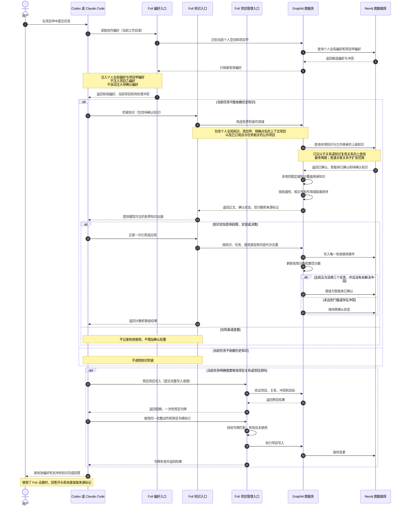

# Fuli 智能体调用时序图

## 实现口径

当前实现不是由 Fuli 服务端无条件把所有知识推给模型，而是通过 MCP 指令要求智能体在每个
任务开始时先读取协作偏好。这样可以自动注入个人全局偏好和当前精确项目偏好，同时避免把
其他项目偏好带入当前对话。普通历史知识则由智能体根据任务内容决定是否检索。

## 关键检查点

1. 偏好读取发生在任务开始阶段。
2. 项目甲不会自动携带项目乙偏好。
3. 待确认普通知识可以按需检索，待确认偏好不能自动注入。
4. 检索本身不增加有效使用次数。
5. 只有真正引用或应用后才记录使用。
6. 项目继承依赖明确关系、知识继承模式和两跳上限。
7. 最终回答只能引用模型实际看到的知识正文，不能只凭来源标题猜测。
8. 只读任务不得尝试调用项目写入工具；项目写入必须先预览并使用匹配的一次性令牌。
