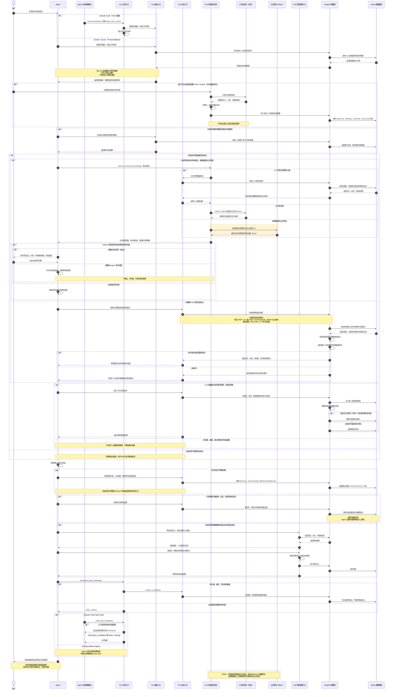

# Fuli 智能体调用时序图

## 实现口径

Fuli 不会由服务端无条件把全部知识推给模型。任务入口只组装当前实际生效的个人全局偏好和
精确项目偏好，普通历史知识由 Agent 按任务需要检索。Claude Code 通过入口与 Stop Hook
执行确定性生命周期检查；Codex、Cursor 等当前依靠 Prompt fallback，遵循相同契约，但宿主
不能保证一定阻止 Agent 漏掉末尾检查。

图中普通路径为已实现；橙色区块是 🟠 Beta；灰色区块是 ⚪ TODO。外部知识库在所有路径中
都只允许读取，`mirror` / `hybrid` 的“同步”只会在本地个人项目形成受限、待确认的镜像。

## 与项目理念的对应关系

1. **不是全部注入**：入口只加载有效偏好，详细知识按需检索。
2. **子项目优先**：先查当前项目，再向明确授权的上级查找共享 Runbook；同键内容以子项目
   为准。
3. **使用不等于看过**：只有真正影响结果才记录使用，检索本身不提高置信度。
4. **人保留最终权威**：Agent 发现候选和处理已授权冲突，但不能伪造人工确认。
5. **不是每次都沉淀**：`capture_candidates` 与 `retain_nothing` 都是完整、正确的任务结尾。
6. **历史不会被静默覆盖**：决策理由、修订和负面证据都保留可追溯关系。

## 关键检查点

1. Claude Code 的 `UserPromptSubmit` 入口和 Stop 检查属于 Hook 强制；其他 Agent 必须标为
   Prompt fallback。
2. 项目甲不会自动携带项目乙偏好；项目级个人偏好也不从父项目向下继承。
3. 待确认普通知识可以按需检索，待确认偏好不能自动注入。
4. 项目继承只沿 `PART_OF` / `USES_KNOWLEDGE_FROM`，最多两跳；`RELATED_TO` 不扩张范围。
5. 最终回答只能引用模型实际看到的知识正文，不能只凭来源标题猜测。
6. 只读任务不得尝试调用项目写入工具；项目写入必须先预览并使用匹配的一次性令牌。
7. 公共知识候选是启发式提示；没有人工选择和预览令牌就不能提升到上级项目。
8. 当前 `record_decision_trace` 支持首次写入的可选验证，但 Benchmark 要求的既有决策后续
   验证入口仍待实现。
9. 未命中回答只显示一次顶部来源标记，底部未命中页脚必须为空。
10. 三方连接器只能读；本地镜像统一进入绑定的个人项目，并保持 `pending`、`restricted`。
11. `ask_human` 是默认冲突策略；`agent_decide` 只授权本次回答，不能产生隐式知识修订。
12. 明确选择公共项目参与聚合检索是 Beta；外部知识直接绑定或自动提升到公共空间仍是 TODO。
13. 当前同步由连接页或 API 手动触发；定时任务、Webhook 和完整删除对账不得描述为已实现。
