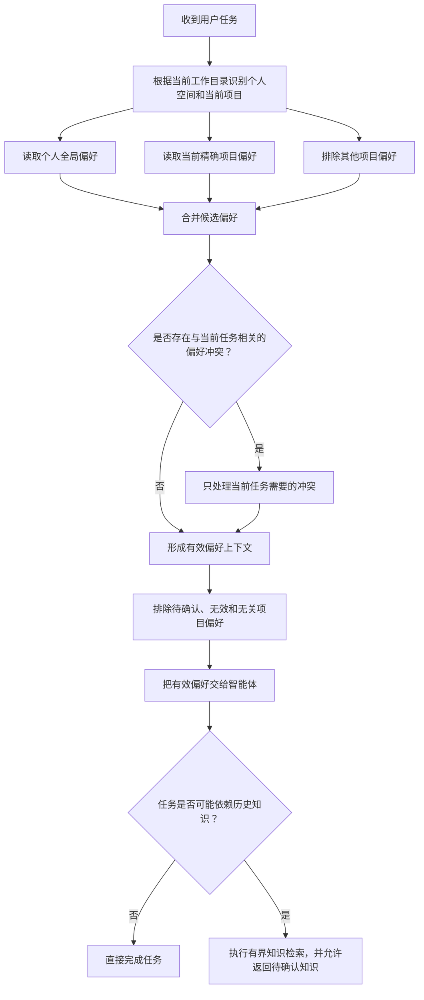
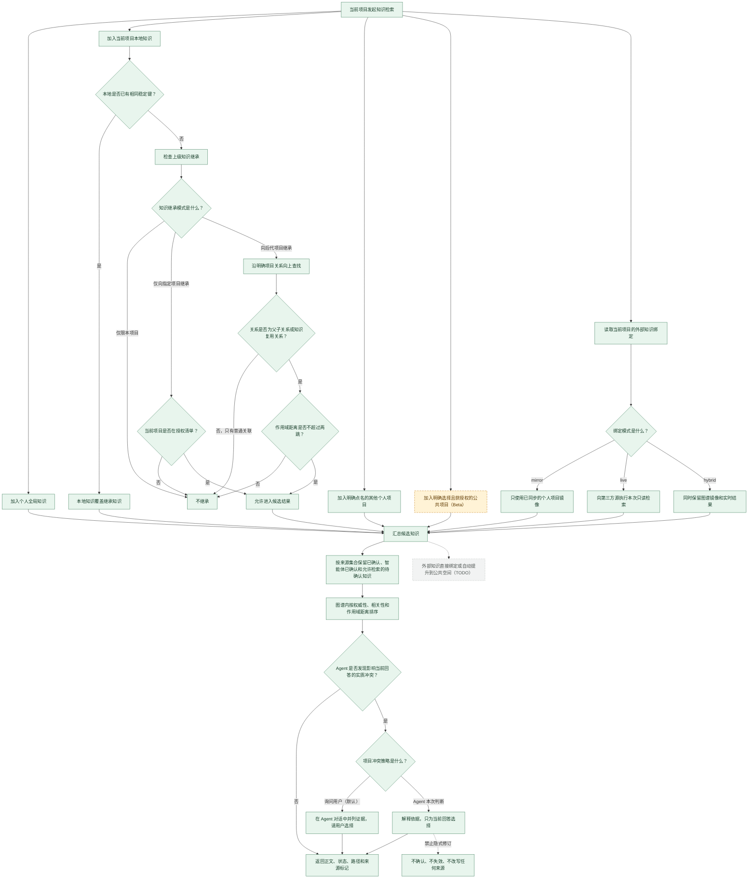
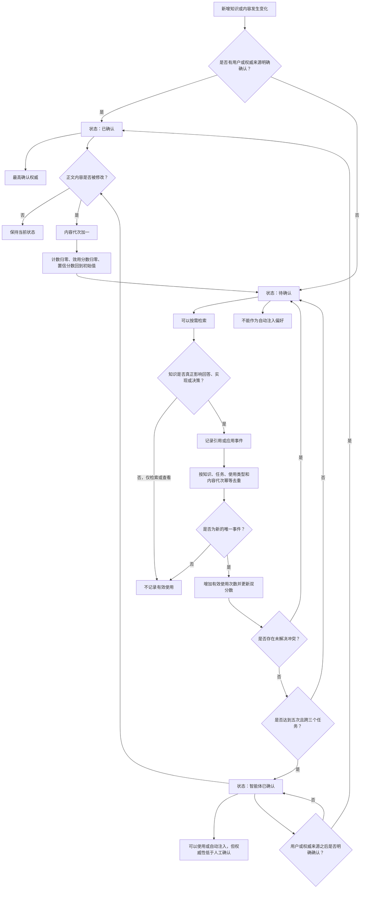
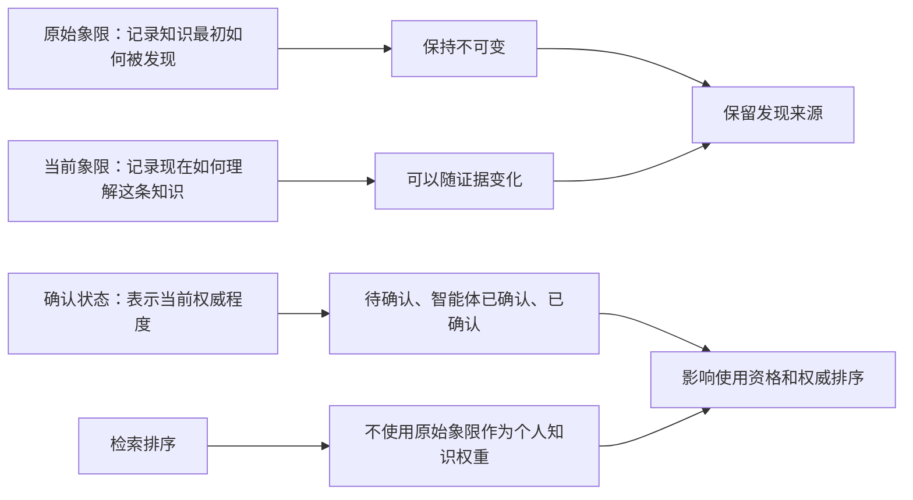

# Fuli 知识检索与确认流程图

状态标记：绿色为 🟢 已实现；橙色虚线为 🟠 Beta；灰色点线为 ⚪ TODO。三方知识源始终
只读，颜色只表示 Fuli 侧能力成熟度。

## 一、任务开始与偏好注入

## 二、项目知识检索范围

## 三、知识确认状态流转

## 四、四象限与确认状态的关系

## 人工检查结论

- 四象限、确认状态和双分数是三个独立维度。
- 项目关系只负责确定“到哪里找”，不自动改变知识真伪。
- 待确认知识可以进入检索，但不会因为被看见就自动增强。
- 智能体已确认是可用但较低权威的中间状态，不等同于人工已确认。
- 内容变化会开启新的确认代次，旧使用次数不能继续累积。
- 命中时可以显示顶部标记和底部来源；未命中时只显示顶部标记，空页脚不重复渲染。
- Fuli Web 使用发布包内的小图标；Codex 链接前的地球图标属于客户端渲染边界。
- 外部 `mirror` / `hybrid` 内容以 `observed`、`pending`、`restricted` 进入绑定的个人项目；
  外部源不会收到写操作。
- 聚合检索保留个人图谱、公共项目和各外部绑定的来源边界；语义冲突由看到正文的 Agent 评估。
- `agent_decide` 只改变本次回答，不改变任何知识状态；公共项目聚合是 Beta，外部知识直接提升
  到公共空间仍是 TODO。
