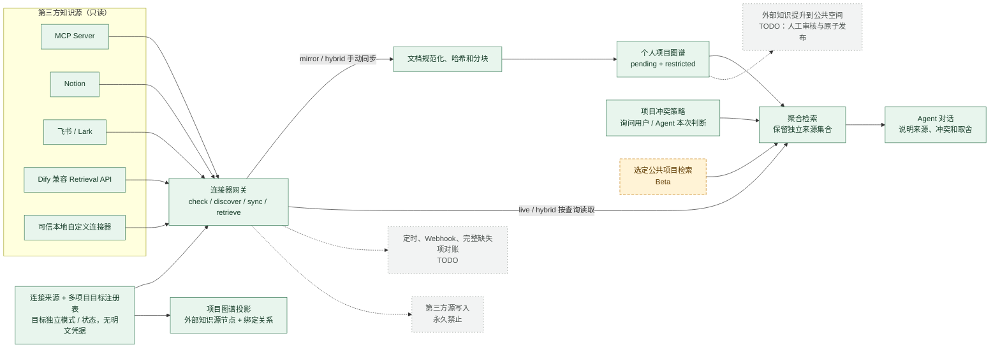

# 外部知识库只读接入架构

更新口径：2026-08-01。

这套实现把第三方知识库当作“有来源、有权限边界的只读证据”，而不是 Fuli 可以反向修改的
数据库。一个外部连接可以绑定到一个或多个现有个人项目，每个目标通过实时检索、镜像同步或
混合模式参与 Agent 回答；它不会自动进入公共空间，也不会因一次 Agent 判断而被改写或确认。

不存在可以脱离真实权限、规模和故障数据而证明“完美”的知识库架构。当前版本的目标是可用、
可审计、故障隔离，并为后续增量同步和公共空间提升保留稳定边界。

## 状态

| 标记 | 含义 |
| --- | --- |
| 🟢 已实现 | 已有运行时代码和自动化测试 |
| 🟠 Beta | 已有可调用路径，但公共部署和大规模真实数据仍需持续验证 |
| ⚪ TODO | 只保留架构位置，当前不应宣称可用 |



## 成熟模式的取舍

当前边界来自以下成熟做法，而不是把某一家产品的私有模型照搬进来：

- MCP 的 Resources 使用 `resources/list`、分页和 `resources/read` 表达可枚举的只读上下文；
  远程授权规范采用 OAuth 2.1。Fuli 因此把 MCP 作为默认协议，但当前 HTTP 客户端只支持预先
  配置的 Bearer/Header 环境变量，交互式 OAuth 流程仍是 TODO。
- Microsoft Graph connectors 把外部项拆成稳定 ID、属性、正文和 ACL，并区分完整爬取与增量
  爬取。Fuli 同样使用稳定外部 ID、内容哈希、游标和目标项目绑定，但不复制第三方 ACL 到
  公共空间。
- Elastic connectors 明确区分 full sync、incremental sync 和 deletion sync。当前 Fuli 已支持
  游标分页、哈希去重、连接器显式删除和解绑失效；定时调度、Webhook 和“完整快照缺失即删除”
  对账仍为 TODO。
- Glean 的检索强调权限感知结果和可追溯引用。Fuli 不把来源集合先压成一个无来源的答案；
  个人图谱、公共项目和每个外部绑定分别返回，最终由 Agent 引用实际看到的证据。
- Open WebUI 允许把知识集合显式附加给模型或按需工具。Fuli 对应采用显式项目目标，不让一个
  已连接来源默认泄漏到所有项目。
- Dify 的外部知识库协议把检索抽象为 `knowledge_id + query + retrieval_setting`。Fuli 内置
  `retrieval_api` 连接器调用兼容端点；不兼容的 RAGFlow 或其他系统应在前面放只读适配器，或
  使用受信任自定义连接器。

参考：

- [MCP Resources 规范（2025-11-25）](https://modelcontextprotocol.io/specification/2025-11-25/server/resources)
- [MCP Authorization 规范（2025-11-25）](https://modelcontextprotocol.io/specification/2025-11-25/basic/authorization)
- [Microsoft Graph connectors externalItem](https://learn.microsoft.com/en-us/graph/api/resources/externalconnectors-externalitem)
- [Microsoft Graph connectors 同步模型](https://learn.microsoft.com/en-us/graph/connecting-external-content-connectors-api-overview)
- [Elastic connector sync types](https://www.elastic.co/guide/en/elasticsearch/reference/current/es-connectors-sync-types.html)
- [Glean Developer Platform](https://developers.glean.com/)
- [Open WebUI Knowledge](https://docs.openwebui.com/features/workspace/knowledge/)
- [Dify 外部知识库接入](https://dify-6c0370d8.mintlify.app/versions/3-0-x/zh/user-guide/knowledge-base/connect-external-knowledge-base)

## 运行模型

### 绑定

一个连接保存一份来源配置，并包含 1 至 32 个已经存在的个人项目目标。每个目标有独立 ID、
检索模式、同步游标、镜像项索引和错误状态：

```json
{
  "name": "Product handbook",
  "connectorType": "mcp",
  "connectorConfig": {},
  "source": {},
  "targets": [
    {
      "personalSpaceId": "<active-personal-space>",
      "personalProjectId": "<first-personal-project>",
      "mode": "hybrid"
    },
    {
      "personalSpaceId": "<active-personal-space>",
      "personalProjectId": "<second-personal-project>",
      "mode": "live"
    }
  ]
}
```

注册表格式为 v2。读取 v1 单项目绑定时，会把原 `target`、`mode` 和 `sync` 原样迁移成第一个
目标；下一次写入注册表时持久化为 v2。连接响应暂时保留首目标的 `target`、`mode`、`sync`
别名，供旧客户端平滑迁移。

运行时拒绝把明文 `token`、`secret`、`password`、`apiKey` 等字段写入注册表。配置中只保存
环境变量名称；真实值只在调用连接器时从进程环境读取。外部返回内容仍会经过 Fuli 的凭据检测。
命中凭据边界的单个文档会被安全跳过，其余文档继续处理；跳过数量会进入同步和检索结果。

### 三种模式

| 模式 | 查询时行为 | 本地图谱 | 适合场景 |
| --- | --- | --- | --- |
| `live` | 每次向外部源只读查询 | 不镜像 | 强实时、外部搜索质量高 |
| `mirror` | 只查已同步的个人图谱 | 手动同步 | 可离线、稳定项目资料 |
| `hybrid` | 同时返回图谱和实时结果 | 手动同步 | 默认；兼顾沉淀与时效 |

混合检索不会在后端把多来源正文强行合成一条“事实”。这样 Agent 才能看到来源、状态和时间，
并在发生矛盾时说明判断依据。

### 同步状态

1. 连接器按游标返回规范化文档。
2. Fuli 对标题、正文、URL、更新时间和元数据计算 SHA-256。
3. 未变化文档跳过；新文档或新版本按目标分别分块写入绑定的个人项目，幂等键包含目标 ID。
4. 外部镜像统一标记为 `observed`、`pending`、`restricted`、`local_only`。
5. 可疑凭据文档不会进入图谱或 Agent 上下文；若同一外部 ID 原有安全镜像，旧镜像会失效。
6. 新版本写入后，旧版本实体通过修订记录失效；连接器报告删除或用户解绑时也会失效。
7. 第三方源从不接收 Fuli 写操作。

同步采用“新版本先写入、旧版本后失效”。如果新内容无法通过安全检查，旧版本仍保持有效，
避免半更新。一个目标失败不会复用另一个目标的游标或镜像索引。当前没有后台定时器；同步由
连接页或 API 显式触发。

### 图谱投影

个人项目图谱读取时，Fuli 会从绑定注册表动态追加 `ExternalKnowledgeSource` 节点和
`USES_EXTERNAL_KNOWLEDGE` 关系。投影只表达“项目使用这个来源”，不伪造正文实体，也不会
修改个人项目档案。解除目标绑定后关系立即消失；若目标曾有镜像内容，镜像实体按修订流程失效。

## 连接器

| 类型 | 读取能力 | 凭据 | 当前边界 |
| --- | --- | --- | --- |
| MCP | Resources `list/read`；可配置 `search` / `fetch` 只读工具 | Bearer/Header 环境变量或 stdio 环境映射 | HTTPS 或回环 HTTP；stdio 命令必须受信任；远程交互式 OAuth TODO |
| Notion | 页面 Markdown、Data Source 查询、工作区搜索 | Integration token 环境变量 | API 版本 `2026-03-11`；绑定必须明确 page IDs 或 data source IDs |
| 飞书 / Lark | Wiki 节点、子节点、搜索和 Docx 纯文本 | access token，或 app ID/secret 环境变量 | 当前只提取 Docx 正文；Wiki 搜索通常需要 user access token |
| RAG Retrieval API | Dify 兼容 `POST` 检索 | 可选 Bearer token 环境变量 | 仅 `live`；HTTPS 或回环 HTTP；稳定文档元数据可提升来源质量 |
| 自定义代码 | 由本地 ESM 模块实现 `sync` / `retrieve` | 只暴露用户列出的环境变量 | 可信代码，不是进程沙箱；模块必须位于连接器目录内 |

Notion 当前 Markdown 接口见 [Retrieve a page as markdown](https://developers.notion.com/guides/data-apis/working-with-markdown-content)。
飞书接口依据 [获取文档纯文本内容](https://open.feishu.cn/document/server-docs/docs/docs/docx-v1/document/raw_content)、
[获取知识空间节点信息](https://open.feishu.cn/document/server-docs/docs/wiki-v2/space-node/get_node)和
[搜索知识空间](https://open.feishu.cn/document/server-docs/docs/wiki-v2/search_wiki)。

### 自定义连接器

模板见 [markdown-folder.mjs](../examples/external-knowledge/markdown-folder.mjs)。安装时把受信任模块放入
`${dataDir}/external-knowledge/connectors/`，然后在连接页填写相对模块名、来源 JSON 和允许暴露的
环境变量名称。

模块契约：

```js
export default {
  async check(context) {},
  async discover(context) {},
  async sync({ config, source, cursor, limit, env }) {},
  async retrieve({ config, source, query, limit, env }) {}
}
```

`context` 同时包含绑定 `mode`；连接建立时会校验实际协商能力是否满足该模式。MCP 以服务端
协商的 Resources / Tools 能力为准，不会因为客户端对象“刚好有同名方法”就假定服务端可用。

`sync` 返回 `{ items, deleted, nextCursor, hasMore }`；`retrieve` 返回 `{ items }`。每个 item 至少
包含稳定 `id`、`title` 和非空 `content`。模块可以读取网络或本地文件，因此只有用户明确安装的
本地代码才应进入这个目录。

## 冲突策略

冲突策略按个人项目保存：

- `ask_human`（默认）：Agent 发现对当前回答有实质影响的矛盾时，在对话中并列来源和差异，
  请用户选择；不改写任何来源。
- `agent_decide`：Agent 可以只为当前回答选择更适用的证据，必须说明时间、作用域、权威和
  来源依据；这个判断不会确认、失效或修改图谱与第三方知识库。

后端只判断“图谱与外部源是否同时有证据并要求语义评估”，不伪装成已经解决语义冲突。真正的
语义比较由看到正文的 Agent 完成。若用户之后要把结论沉淀成长期知识，仍走原有确认、决策轨迹
或人工审核流程。

## 公共空间

`search_connected_knowledge` 可以在一次调用中查询：

- 当前个人项目及获授权的个人项目来源；
- 当前项目绑定的实时外部知识；
- 调用方明确传入的公共项目 IDs（🟠 Beta）。

公共结果由现有项目订阅和 Provider 边界约束。当前不支持把外部绑定直接指向公共空间，也不
允许自动把第三方内容发布为公共知识。后续公共化必须采用“个人项目候选 → 人工审核 → 预览
令牌 → 原子发布”，并保留第三方来源和许可信息；该链路目前是 ⚪ TODO。

## HTTP 与 Agent 接口

| 方法 | 路径 | 用途 |
| --- | --- | --- |
| `GET` | `/api/external-knowledge/connectors` | 连接器能力清单 |
| `POST` | `/api/external-knowledge/discover` | 浏览可绑定来源 |
| `GET/POST` | `/api/external-knowledge/bindings` | 列表 / 创建绑定 |
| `PATCH` | `/api/external-knowledge/bindings/:id/targets` | 多选增删项目目标并设置目标模式 |
| `POST` | `/api/external-knowledge/bindings/:id/check` | 连通性与权限检查 |
| `POST` | `/api/external-knowledge/bindings/:id/sync` | 手动同步 |
| `POST` | `/api/external-knowledge/bindings/:id/retrieve` | 单绑定实时检索 |
| `DELETE` | `/api/external-knowledge/bindings/:id` | 解绑并失效镜像实体 |
| `GET/PATCH` | `/api/external-knowledge/conflict-policy` | 读取 / 修改项目冲突策略 |
| `POST` | `/api/connected-knowledge/search` | 聚合图谱、外部源和选定公共项目 |

Agent 使用 `search_connected_knowledge`。运行时只选择与当前 `personalSpaceId + personalProjectId`
完全匹配且允许实时检索的目标，不会因为同一来源绑定了其他项目而跨项目返回。它属于开放世界
读取：会访问外部网络，同时图谱检索会
记录 Agent 查看事件，因此 MCP 注解不会把它伪标成纯本地、无副作用读取。
外部错误只返回有界诊断；疑似包含凭据的错误文本会替换为保护性说明，不写入注册表或返回给
Agent。

## 验证

默认测试使用显式标注的 fixture / mock 响应验证协议、分页、安全边界、API、Agent 工具和 Vue
连接页；这些数据不是运行事实。真实联网验证使用两个公开官方文档仓库，在系统临时目录完成
浅克隆、同步映射和只读检索，并在 `finally` 中删除全部下载内容：

```sh
npm run test:external-knowledge:live
```

验证源：

- [Model Context Protocol specification and documentation](https://github.com/modelcontextprotocol/modelcontextprotocol)
- [Official Notion JavaScript client documentation](https://github.com/makenotion/notion-sdk-js)

这个联网测试不进入默认持续集成，因为它依赖 GitHub 可用性。脚本不会复用机器的 Git 身份或
凭据配置，也不会把下载的知识库保留在仓库或本地数据目录中。

## 后续边界

- ⚪ MCP 远程 OAuth 2.1 授权码 / PKCE 生命周期。
- ⚪ 后台定时同步、Webhook、退避重试和每源限流仪表盘。
- ⚪ 完整快照删除对账；当前只处理连接器明确报告的删除和解绑。
- ⚪ 附件、图片、PDF、飞书 Sheet/Bitable/Slides 的专用正文提取。
- ⚪ 外部知识经人工审核提升到公共空间，并保留许可与 ACL 证明。
- ⚪ 大规模真实租户上的召回质量、延迟、配额和灾难恢复指标。
