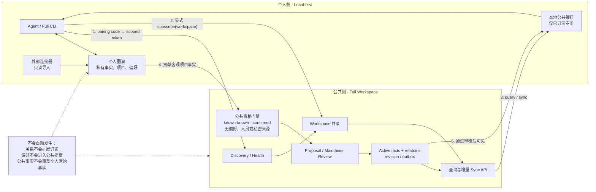

# 公共空间与个人图谱联动架构

这张图描述 Fuli 的默认边界：个人图谱是私有的，公共空间是经过治理的共享事实层。两者通过明确的订阅、提案、审核和同步连接，不通过“自动把所有个人内容上传”连接。

## 两条联动路径

### 个人读取公共空间

1. 本地管理员或用户用一次性 pairing code 取得独立的 reader/contributor token。
2. 本地明确订阅一个或多个 Workspace；订阅记录保存在个人侧。
3. Fuli 只读取已订阅 Workspace 的公开事实和 active 关系，并把结果放进本地公共缓存。
4. 后续查询可以读取缓存；需要更新时使用 cursor 增量同步。公共关系只用于展示上下文，不会静默新增订阅或扩大授权范围。

### 个人贡献到公共空间

1. 个人图谱中已经确认的客观项目事实形成 Proposal 草稿。
2. 公共服务再次执行资格校验：必须是 `known_known`、`confirmed`、可审计，且不包含个人偏好、人员/联系方式、凭据、私有 URI 或本机路径。
3. Proposal 进入公共 Workspace 的维护者审核队列；Agent 不能替人作最终决策。
4. 维护者接受后，服务生成新的 revision 和 outbox 事件，订阅客户端在下一次 sync 中得到该事实。

## 数据边界

| 数据 | 默认位置 | 是否可进入公共空间 |
| --- | --- | --- |
| 客观项目事实、已确认决策、可复用 Runbook | 个人图谱 | 可以，需通过资格门禁和维护者审核 |
| 用户品味、风格、个性、判断 | 个人图谱 | 不可以 |
| 人员、联系方式、POC、凭据和私有来源 | 个人图谱或外部源 | 不可以 |
| 公共 Workspace 的 active accepted facts | 公共服务 | 订阅后可查询和同步到本地缓存 |
| pending、rejected、archived 或 superseded 内容 | 公共服务历史 | 不进入匿名公共知识投影 |

## 运行时不变量

- 公共服务不持有个人 Provider 的 token；每个客户端使用独立的 scoped token。
- 订阅是显式动作，`PART_OF` 等关系只表达拓扑，不表达授权。
- 公共页面只展示 allowlist DTO，不展示 evidence、source URI、确认人、proposal 元数据或本机路径。
- 本地缓存可以离线查询，但离线缓存不改变公共服务的审核状态。
- 个人原始事实和公共投影分开保留；公共修订不会覆盖个人历史。

相关实现：`src/graphiti/workspace-provider-client.js`、`src/graphiti/federated-application.js`、`src/workspace-protocol/` 以及公共 Workspace 服务的治理/同步接口。
