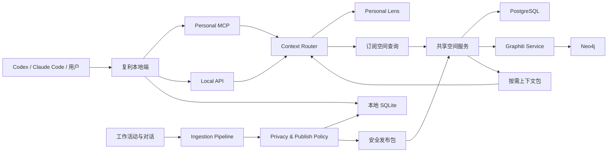
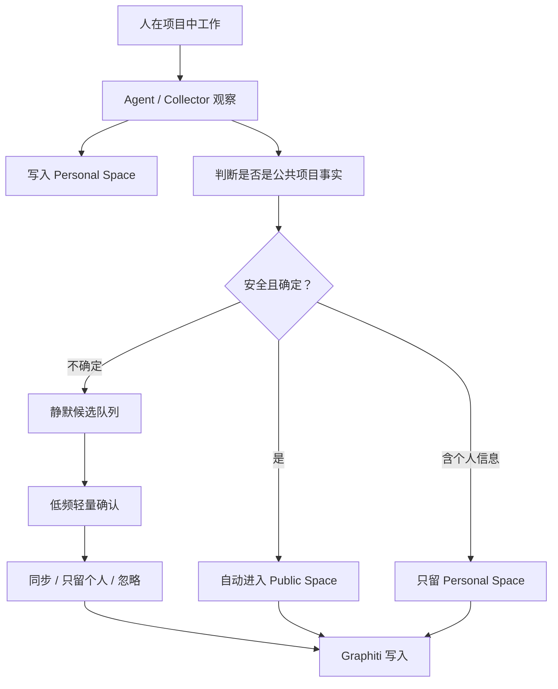

# 复利设计文档

## 宗旨

复利是一个面向个人和团队工作的上下文增长系统。它不是笔记软件，也不是普通知识库。它的核心目标是让一个人、一个项目、一个业务空间在持续工作中自动沉淀事实、历史、方法、判断脉络和可复用上下文，并让 Agent 在需要时按需查询，而不是把所有内容一次性塞进上下文。

产品原则：

- 易用：人只做轻量判断，不承担整理工作。
- 方便：默认在工作流里自动采集、自动归类、自动检索。
- 可自增长：空间会随着工作持续演化，历史不丢，当前答案清晰。
- 不接管判断：AI 可以观察、整理、提出候选，但人的判断力最终由人确认。
- 公共可信：公共空间默认只接受有来源、可追溯、较确定的项目事实。
- 个人成长：个人空间可以保存完整上下文、候选观察、偏好、盲区和历史判断。

## 核心抽象

### Space

Space 是复利里最重要的抽象，表示一个可以沉淀上下文的空间。它不预设生活、工作、权限这些固定分类，而由用户和组织自由定义。

常见 Space：

- Personal Space：一个人的本地空间。
- Project Space：一个项目的公共上下文。
- Business Space：一个业务、产品线、客户或领域的上下文。
- Method Space：一组方法论、团队实践、技术原则。

### Personal Space

Personal Space 是人的 Lens。它保存这个人的工作习惯、品味、偏好、判断记录、常用工具、已订阅空间和本地上下文。

它可以保存不够确定的内容，但必须标记状态：

- confirmed：用户确认过。
- observed：AI 观察到。
- suggested：AI 建议沉淀。
- rejected：用户否决。
- deprecated：过去成立，现在废弃。

### Public Space

Public Space 是项目、业务或方法论的共享上下文。它默认只发布公共事实，不发布个人信息。

默认可进入公共空间的内容：

- 项目参数、接口字段、环境链接。
- PRD、会议结论、技术决策。
- 当前规则、已废弃规则、替代关系。
- 有来源的历史变更。
- 明确的已知问题。

默认只留在个人空间的内容：

- 个人偏好、个人感受、个人判断。
- 未确认的人格、品味、方法论观察。
- 本地开发习惯。
- 混有个人信息的片段。

### Subscription

Subscription 表示个人空间认领或订阅其他空间。个人空间不复制公共空间的全量内容，而是在查询时通过订阅关系按需读取。

订阅可以有读取模式：

- latest：读取最新稳定事实。
- pinned：固定在某个版本或时间点。
- preview：允许读取候选事实。
- local-overlay：允许个人空间的本地规则优先。

### Episode

Episode 是原始输入事件。它是所有图谱事实的来源。

常见 Episode：

- PRD、Markdown、设计文档。
- Git commit、PR、issue。
- 聊天、会议、日志。
- Agent 执行过程。
- 用户手动补充的一段说明。

### Fact

Fact 是从 Episode 中抽取出的时间化事实或关系。会变化的内容必须建成 Fact，而不是静态字段。

示例：

- Project A uses Test URL X.
- Project A replaced PRD v2 rule with PRD v3 rule.
- User prefers small explicit modules when building tools.
- Method X is forbidden in Project A.

Fact 必须支持：

- source episode。
- valid_at / invalid_at。
- confidence。
- current / historical / deprecated 状态。
- replaces / replaced_by 关系。

## 知识确定性模型

复利使用个人维度和公共维度作为第一层边界，再使用确定性状态描述内容。

个人维度：

- 可以容纳已知的已知、已知的未知、未知的已知候选和盲区提示。
- 用于个人成长、工作 Lens、方法沉淀和 Agent 个性化。

公共维度：

- 默认只发布已知的已知。
- 可以保存已知的未知，但必须明确标记为问题、风险或待确认项。
- 不把未知的已知或 AI 推断当作公共事实。

四象限含义：

- 已知的已知：确定事实、当前规则、确认过的方法。
- 已知的未知：明确缺失、待确认、待决策的问题。
- 未知的已知：系统从历史行为中观察到的隐性模式，默认是候选。
- 未知的未知：系统提示可能缺失的盲区，不作为知识发布。

## Personal Lens：认识用户

Personal Lens 是个人空间面向 Agent 的稳定投影。它不是一份静态用户档案，也不是每次全量注入的长提示词；它是由有来源、带状态、可纠正的个人事实组成，并根据当前任务按需生成紧凑上下文。

Personal Lens 可以描述：

- 身份与工作背景：用户明确提供的角色、时区、常用环境和长期目标。
- 能力边界：用户自述的熟悉、略懂和不了解的领域，以及后续发生的变化。
- 协作偏好：希望 Agent 直接执行、先给选项、解释到什么深度、如何汇报结果。
- 工作方法：反复确认过的流程、质量标准、工具习惯和复盘方法。
- 品味与判断：用户明确表达或确认过的取舍原则、设计偏好和判断依据。
- 边界：用户不希望保存、推断、公开或自动执行的内容。

每条 Lens Fact 必须包含：

- `subject`、`predicate`、`object`。
- `status`：`confirmed`、`observed`、`suggested`、`rejected` 或 `deprecated`。
- `source_episode_id` 与来源类型。
- `valid_at`、`invalid_at` 与替代关系。
- `confidence`，仅描述证据强度，不代替人的确认。
- `sensitivity`：`normal`、`private` 或 `restricted`。
- `scope`：默认 `personal`；Personal Lens Fact 永远不能自动发布到公共空间。

### 三种认识方式

#### 主动访谈

复利提供 MCP Prompt `get_to_know_me`。Agent 先查询已有 Lens，再只询问缺失、冲突或不确定的稳定信息。访谈规则：

- 一次只问一个问题。
- 已经知道的内容不重复询问。
- 用户可以跳过任何问题。
- 不主动询问凭据、精确地址等敏感信息。
- 每个明确回答只生成一条简洁、可纠正的 confirmed Lens Fact。
- 访谈结束时展示新增理解，并允许用户立即纠正。

默认问题域包括沟通方式、技术深度、学习偏好、代码质量取舍、协作方式、工作环境和长期边界。问题不是固定问卷；已有信息充分时可以零问题结束。

#### 显式存储

用户可以自然地说“记住……”“以后……”“我更喜欢……”。Agent 通过 `remember_user_fact` 写入明确陈述，通过 `correct_user_fact` 替换、废弃或否定旧认知。显式写入必须保存原始来源，不能只保存 Agent 改写后的结论。

#### 后台观察

Agent 或 Collector 可以在正常工作后调用 `submit_user_observation`：

- 用户直接陈述但没有主动要求记住的内容，可以进入 `observed`。
- 从多次行为中归纳出的模式只能进入 `suggested`。
- 性格、判断力、价值取向和能力评价不得由 AI 自动升级为 `confirmed`。
- 临时任务、一次性路径、普通寒暄和可轻易重新发现的信息不进入 Lens。
- 凭据、密钥、令牌和明显敏感信息在进入存储前直接拒绝。

### 查询与注入

Agent 默认按需调用 `get_user_lens`，而不是读取个人空间全库：

```json
{
  "task": "为当前项目设计前端架构",
  "budget": 600,
  "includeObserved": true,
  "includeSuggested": false
}
```

返回结果遵守以下规则：

- 只返回与当前任务相关的事实。
- 默认以 confirmed 为主，observed 明确标记，suggested 默认不注入。
- 返回来源摘要、有效时间和替代信息。
- `budget` 是硬上限；超出时优先保留边界、当前规则和高相关事实。
- 用户可以查询“你为什么这样理解我”，系统必须返回证据链。
- 用户纠正后，旧认知进入历史，不再出现在默认 Lens 中。

客户端可以在会话开始时主动注入一个极短的 Core Lens，但它仍由 `get_user_lens` 动态生成，不保存为另一个不可追溯的真相副本。

## 系统架构



## 技术架构

复利采用分层架构，避免把 Graphiti、MCP、UI 和同步逻辑揉成一个系统。

### 依赖选择原则

复利不为了快速生成内容而绑定不清晰或难以长期商用的基础设施。复杂能力优先使用成熟开源项目，但必须保持可替换边界。

依赖选择优先级：

1. 首选 Apache-2.0、MIT、BSD、PostgreSQL License 等宽松可商用协议。
2. GPL、AGPL、SSPL、BSL 等协议必须单独评估，不能无意识嵌入核心分发包。
3. 基础设施通过 adapter/port 隔离，不把某个数据库或供应商写死进业务模型。
4. 版本、工作流、搜索、图谱等复杂能力优先采用成熟项目，不从零自造。
5. 用户熟悉 JavaScript，默认实现语言采用 plain JavaScript；除非 JS 明显不适合某个能力，否则不优先引入其他语言或 TypeScript。

Graphiti 是时间化知识图谱引擎，不是自带数据库的一体化产品。它负责抽取、建模、事实失效、时间化关系和检索逻辑，但仍需要图数据库作为持久化后端。

### Local Runtime

本地运行时负责个人空间、Agent 接入、订阅路由和本地自动沉淀。

组件：

- Personal MCP Server：使用正式 MCP SDK，通过 stdio 或 Streamable HTTP 给 Codex、Claude Code 和本地 Agent 提供稳定工具、Prompts 和 Resources。
- Local API：给 UI、CLI 和后台任务使用。
- Context Router：根据当前仓库、任务、问题和订阅关系决定查询哪些 Space。
- Local Store：使用 SQLite 保存个人空间、Lens Facts、Episode、订阅、候选队列、同步状态和本地原始资料索引。

本地运行时在无网络、无 Graphiti、无共享空间服务时仍然可以完整记录、查询和维护个人空间。共享服务不可用时，发布包进入可重试的本地 Outbox，不阻塞个人工作流。

### Space Service

空间服务负责公共空间的写入、发布、查询和同步。

组件：

- Space API：创建 Space、订阅 Space、查询 Space。
- Ingestion Workers：处理 PRD、Git、会议、聊天、文档等输入。
- Publish Classifier：判断内容进入个人空间、公共空间或候选队列。
- Review Surface：轻量确认，不做重型审批系统。

共享空间服务使用 PostgreSQL 作为权威事实层，保存 Space、成员、Episode、发布记录、确认记录、同步游标和审计信息。Graphiti 是共享服务内部的派生索引，不是空间数据唯一来源。

### Graph Layer

Graphiti 作为时间化知识图谱内核。

使用原则：

- 会变化的东西建成 relationship/fact。
- 不把变化内容只存为 entity attribute。
- 默认查询 active facts。
- 历史查询显式读取 invalidated facts。
- 替代关系用 replaces / supersedes 表达。
- 每个事实必须有来源 episode。
- Graphiti `group_id` 映射复利 `space_id`，映射关系由 Space Service 管理。
- Graphiti 写入失败可以从 PostgreSQL Episode 与发布记录重建，不得造成已确认事实丢失。

推荐后端：

- Neo4j：Graphiti 当前最成熟的生产路径之一，适合长期共享空间；因协议和分发方式需要单独评估，复利不得把它硬编码为不可替换依赖。
- FalkorDB：Graphiti 支持良好，适合本地 Docker 和轻量环境；因 SSPL 类协议风险，不能作为唯一生产绑定。
- Kuzu：协议宽松且适合嵌入式场景，但 Graphiti 当前已不建议新项目优先使用，暂不作为主路径。
- Apache AGE / PostgreSQL 图方案：协议友好，适合长期评估；需要 Graphiti adapter 验证后才能作为主路径。

配套存储：

- SQLite：个人空间、Personal Lens、本地 Episode、候选队列、订阅与 Outbox 的权威存储。
- PostgreSQL：公共空间、成员、来源、发布记录、同步状态与审计记录的权威存储。
- Git：原始文本和项目资料的版本化快照。
- JSON file store：仅作为已有数据迁移来源和测试夹具，不再作为正式运行后端。
- Dolt：如果未来需要结构化表数据的分支、diff、merge，再引入，不提前复杂化。
- Qdrant：如果 Graphiti 内置检索不能满足跨空间向量召回，再作为独立向量索引引入。
- Temporal：如果 ingestion、同步、重试、长任务编排变复杂，再作为工作流引擎引入。

### Source Store

原始资料永远保留，图谱事实只是索引和抽取结果。

来源包括：

- 本地文件和 Markdown。
- Git / PR / issue。
- PRD 和外部文档。
- 聊天、会议、日志。
- Agent 操作记录。

## Agent 工具

Personal MCP 暴露少量高价值工具，避免让 Agent 直接读全库。

核心工具：

- `remember_episode`：写入新的工作片段。
- `remember_user_fact`：保存用户明确表达并允许记住的个人事实或偏好。
- `correct_user_fact`：纠正、替换、废弃或否定既有个人认知。
- `submit_user_observation`：提交 Agent 观察；推断内容只能成为候选。
- `get_user_lens`：按任务与 token budget 生成紧凑 Personal Lens。
- `search_user_context`：查询个人事实、来源和演化历史。
- `search_context`：按问题查询个人空间和订阅空间。
- `search_space`：查询指定 Space。
- `get_current_facts`：只查当前有效事实。
- `get_timeline`：查某对象的演化历史。
- `get_project_rules`：查当前项目规则和禁用方案。
- `confirm_observation`：用户确认候选观察。

MCP Prompt：

- `get_to_know_me`：运行短访谈，补足稳定、跨项目的 Personal Lens。

MCP Resource：

- `fuli://lens/current`：当前紧凑 Lens，只包含默认可注入内容。
- `fuli://lens/history`：Lens 演化与替代历史，必须显式读取。
- `fuli://spaces/subscribed`：已订阅空间及其查询能力，不返回空间全量内容。

默认查询策略：

1. 识别当前上下文：用户、仓库、项目、任务。
2. 查询 Personal Space 的 Lens 和订阅。
3. 查询相关 Public Spaces 的当前事实。
4. 仅在问题涉及历史、案例、替代关系时读取历史事实。
5. 返回带来源和时间的简洁答案。

复利不直接向 Agent 暴露 Graphiti 原始 MCP。Graphiti 官方 MCP 仍处于快速演进阶段，复利通过自己的稳定工具契约隔离版本、安全和底层数据库变化。

## 自动增长流程

复利默认不打扰用户。



人的交互保持极简：

- 默认无感。
- 候选集中处理。
- 每个候选只需要：同步、只留个人、忽略。
- 高影响变更才提示用户。

## 安全发布规则

公共空间默认只接受项目事实。

自动发布必须满足：

- 来自当前项目或可信来源。
- 描述项目事实，不描述个人感受。
- 有 source episode。
- 不包含明显个人信息。
- 能判断是否替代已有事实。

不满足时进入候选队列或只留个人空间。

## 多人更新模型

多人订阅同一个 Space 时，个人工作流仍然保持轻量。

规则：

- 个人空间是默认写入地。
- 公共空间是稳定事实地。
- 本地观察不会直接污染公共空间。
- 明确、安全、有来源的项目事实可以自动发布。
- 不确定内容进入静默候选。
- 空间维护不是审批系统，而是事实进入公共空间的轻量边界。

### 安全发布包

本地端不会把个人空间或完整对话同步到共享服务。它只发送经过 Policy Engine 处理的发布包：

```json
{
  "id": "publication-id",
  "spaceId": "target-space-id",
  "source": {
    "kind": "prd",
    "uri": "optional-source-uri",
    "capturedAt": "2026-07-10T00:00:00.000Z"
  },
  "facts": [],
  "contentHash": "sha256",
  "policyVersion": "1"
}
```

发布包不包含 Personal Lens Fact、凭据、被拒绝候选或无来源的 AI 推断。服务端重新验证发布策略，不能信任客户端已经完成安全检查。

## UI 方向

复利不以笔记列表作为第一界面。

核心界面应该围绕：

- Space：有哪些空间，空间现在知道什么。
- Timeline：一个项目、参数、规则或判断如何变化。
- Lens：个人如何使用这些空间。
- Candidates：有哪些 AI 观察等待确认。
- Sources：事实从哪里来。

UI 要服务工作，不做装饰型知识库。

## 非目标

当前设计不把以下内容作为核心：

- 重型权限系统。
- 传统笔记编辑器。
- 人工维护型知识库流程。
- 一次性全量喂给 Agent。
- AI 自动定义人的人格或判断力。

## 开发策略

终局架构不妥协，但工程推进采用可验证的垂直切片。

每个切片必须同时覆盖：

- 一个真实输入来源。
- 一个 Space 写入路径。
- 一个 Graphiti 时间化事实。
- 一个 MCP 查询工具。
- 一个可验证的返回结果。

这样每一步都是完整系统的一小段，而不是临时低配版本。

## 首个正式建设单元

首个正式建设单元是“本地个人运行时 + Personal Lens + 安全发布契约 + 标准 MCP”。它不是新的 MVP，而是正式架构中可以长期保留的第一个完整子系统。

交付条件：

1. SQLite 带迁移版本，替代 JSON 正式运行存储，并能导入已有 JSON 数据。
2. 领域服务不再读取 `store.data`，所有访问都经过稳定 Store Port。
3. MCP 使用官方 JavaScript SDK，支持真实工具调用、Prompt 与 Resource。
4. Personal Lens 支持主动访谈、显式写入、后台观察、纠正、历史和按需注入。
5. 所有 Lens Fact 有来源、状态、时间、敏感级别和替代关系。
6. 公共发布只生成安全发布包，个人信息在结构与测试上都不能进入发布结果。
7. 本地端离线可用，共享服务故障时 Outbox 可重试且不丢数据。
8. Web、CLI 和 MCP 使用同一应用服务，不分别实现业务规则。
9. 自动测试覆盖隐私边界、状态演化、迁移、MCP 协议与失败恢复。
10. 本地控制台保持极简，内部架构升级不增加默认操作负担。

### 实现状态（2026-07-11）

Formal local runtime 已实现：

- SQLite 版本化迁移、legacy JSON 幂等导入和 Store Port；Web、CLI、MCP 共用稳定应用服务。
- Personal Lens 的显式记忆、观察、确认、纠正、历史、来源追踪和有界检索。
- 敏感内容拒绝、可验证的安全发布 envelope，以及持久化、可重试的 Outbox。
- 基于官方 SDK 的 MCP stdio tools、`get_to_know_me` Prompt 和 Lens/订阅 Resources。
- Web 中的个人记忆投影收纳于“记忆”视图，不增加默认操作负担。

下一份独立计划：PostgreSQL shared-space service plus Graphiti/Neo4j projection worker。该计划消费本地 Outbox 发布契约，不改变已完成的 local runtime 边界。

## 开源取舍记录

- Graphiti：Apache-2.0。采用其时态图谱与 Episode/Fact 模型，通过独立 Python 服务接入。
- `@modelcontextprotocol/sdk`：采用官方 SDK 实现复利稳定 MCP，不复用 Graphiti 实验性 MCP 作为产品协议。
- Mem0：Apache-2.0。借鉴事实提取和 ADD/UPDATE/DELETE/NONE 记忆更新模型，不直接绑定其运行时。
- LangMem：MIT。借鉴“结构化用户 Profile 与详细语义记忆分离”的设计。
- Letta：Apache-2.0。借鉴少量 Core Memory 与大量按需检索记忆分层。
- Claude Honcho 插件：MIT。借鉴先查询已有认知、一次一问、只补缺口、允许纠正的访谈 Skill。
- Honcho Core：AGPL-3.0。只研究其 Peer Representation 与后台观察思想，不嵌入、不复制核心实现。
- OpenClaw：许可需要逐文件确认，只借鉴 `USER.md` 的产品原则，不复制实现。

任何第三方提示词只作为研究输入。复利最终提示词必须遵守来源透明、不可伪造、敏感信息拒绝、用户可纠正和人的判断优先原则。
