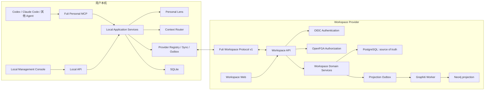

# 复利联邦式工作空间设计

**状态：** 已确认

**日期：** 2026-07-11

**前置设计：** [复利设计文档](./2026-07-10-compound-interest-design.md)

本设计细化并替代前置文档中与共享空间部署、多人权限、跨空间同步和前端信息架构有关的早期描述；Personal Runtime 与 Personal Lens 的既有设计继续有效。

## 1. 目标

本设计定义复利的第二个正式建设单元：联邦式 Workspace Provider。

复利由两个独立但可协作的产品面组成：

- Personal Runtime：运行在用户本机，保存个人记忆、Personal Lens、订阅、缓存和待发布内容，是本地 Agent 的唯一默认入口。
- Workspace Provider：运行在服务器或本地环境，承载一个或多个可共享工作空间，负责公共事实、成员、版本、审核和同步。

用户可以同时订阅官方、企业、自托管和本地 Provider。不同 Provider 实现同一份开放协议，复利官方服务只是默认 Provider，不是唯一中心。

## 2. 已确认原则

- 易用：正常工作不要求用户整理知识；人只处理加入、冲突、替换、删除和方向性判断。
- 本地优先：个人数据默认只在本地，Personal Runtime 离线仍可工作。
- 公共可信：Workspace 默认只接收有来源、可追溯的工作事实。
- 当前优先，历史可查：默认回答当前有效事实，同时保存完整替代链和时间线。
- 人的判断优先：AI 可以提取、关联、发现冲突和提出建议，不能决定项目方向、价值判断或重大替换。
- 最小披露：查询 Provider 时不发送 Personal Lens、完整对话或无关个人上下文。
- 权威与投影分离：PostgreSQL 是共享空间权威源；Graphiti/Neo4j 是可重建的关系检索投影。
- 开放实现：核心协议和业务模型使用 plain JavaScript；Graphiti Worker 保持独立 Python 服务。

### 2.1 安装体验也是产品契约

复利不能把内部架构复杂度转嫁给个人用户或空间维护者。安装、Agent 接入、部署、升级、诊断、备份和恢复必须与核心功能一起设计和测试。

最终用户入口保持为两个：

```bash
fuli setup
fuli deploy
```

`fuli setup` 面向个人电脑，并自动完成：

- 选择安全的本地数据目录并初始化 SQLite。
- 安装和启动 Personal Runtime 后台服务。
- 自动发现 Codex、Claude Code 等受支持 Agent。
- 展示一次即将修改的 Agent 配置，用户确认后先备份再写入 MCP 配置。
- 执行健康检查并打开 Local Management Console。

个人安装包必须携带运行所需依赖。用户不需要预装 Node.js、Python、Docker，也不需要手工编辑 JSON、环境变量或 MCP 配置。

`fuli deploy` 面向自托管服务器，并自动完成：

- 环境与端口预检。
- 生成并安全保存服务密钥。
- 启动 Workspace Provider、PostgreSQL、OpenFGA、OIDC adapter 和图谱投影服务。
- 执行数据库迁移、授权模型初始化和健康检查。
- 返回 Workspace Web 地址和一次性管理员邀请。

默认部署最多询问域名和管理员身份。已有企业 OIDC、外部 PostgreSQL 或其他高级配置通过可选参数接入，不进入默认问答路径。使用官方 Workspace Provider 的用户不需要执行 `fuli deploy`。

运维入口保持稳定：

- `fuli status`：返回人可读状态和机器可读退出码。
- `fuli update`：备份、升级、迁移、健康检查，失败时自动回滚。
- `fuli doctor`：发现并自动修复常见配置、权限、端口和 Agent 接入问题。
- `fuli backup`：生成可验证、可恢复的本地或服务器备份。
- `fuli uninstall`：默认保留数据，删除数据必须再次明确确认。

安装与部署工具是独立编排层，不复制业务规则。所有命令必须幂等、可恢复、可审计，不允许要求用户直接操作数据库、OpenFGA model ID、签名密钥或内部容器。

验收条件：

1. 新个人用户可以在一次安装和一次确认内连接首个 Agent。
2. fresh machine 执行 `fuli setup` 后无需人工修改配置即可通过 MCP 健康检查。
3. fresh server 执行 `fuli deploy` 后可以打开 Workspace Web，并通过真实鉴权查询一个工作空间。
4. 重复执行 setup/deploy 不产生重复身份、重复订阅、重复迁移或数据损坏。
5. 失败升级能够恢复到升级前可用状态。
6. 默认日志和终端输出不显示令牌、密钥、Personal Lens 或私密来源正文。

## 3. 总体架构



### 3.1 信任边界

- Agent 默认只连接 Personal MCP，不分别保存每个 Provider 的业务逻辑。
- Personal Runtime 在发送前做隐私切分，但 Provider 必须重新验证身份、权限、来源、内容策略、签名和幂等键。
- Provider 之间不自动交换内容。跨空间引用默认只保存稳定标识和链接，复制正文需要显式发布。
- Provider 不能读取 Personal Lens。远程查询只接收工作空间范围内的结构化检索条件，不接收完整个人提示词。
- Provider 凭据保存在操作系统安全凭据库；SQLite 只保存 Provider 元数据和非敏感同步状态。
- Publication proposal 中的来源 URI 必须是可公开或可授权访问的稳定引用；本地绝对路径、用户名和临时目录在发送前移除。

## 4. 核心数据模型

信息被建模为一条可追溯的演化链，而不是可覆盖的笔记。

### 4.1 Episode

Episode 是不可静默改写的原始记录：PRD、Git 变更、会议结论、网页、对话或人工输入。

关键字段：

- `id`、`workspace_id`、`source_kind`、`source_uri`。
- `captured_at`、`occurred_at`、`created_by`。
- `content_hash`、`content_ref`、`metadata`。
- `visibility`、`retention_state`。

原始大文本可以保存在对象存储或 Git，PostgreSQL 保存摘要、哈希和稳定引用。

### 4.2 Fact

Fact 是 Agent 可查询的最小事实单元。

关键字段：

- `id`、`workspace_id`、`subject`、`predicate`、`object`。
- `status`：`active`、`superseded`、`retracted`、`disputed`。
- `valid_from`、`valid_to`、`recorded_at`。
- `certainty`：`confirmed` 或 `known_unknown`。
- `source_episode_ids`、`created_by`、`revision`。

公共空间不把 AI 推断直接保存为 confirmed Fact。AI 提取结果先作为 Proposal，经策略或人工决定后生成 Fact。

### 4.3 Revision

Revision 是只追加的变化记录，表达：

- `adds`：增加新事实。
- `supplements`：补充已有事实。
- `replaces`：新事实替代旧事实。
- `conflicts_with`：来源互相冲突。
- `retracts`：事实被撤回。
- `restores`：从历史版本恢复。

旧 Fact 不删除。默认查询只返回 `active`，历史查询按时间点重建当时有效的事实集合。

### 4.4 Proposal 与 Decision

Proposal 保存尚未生效的候选变化，Decision 保存系统或人的决定。

Decision 必须记录：

- 决定类型、执行者、时间和理由。
- 使用的证据与受影响 Fact。
- 策略版本和授权检查结果。
- 自动决定时使用的确定性规则；AI 分数只能作为解释信息。

## 5. Provider 与订阅模型

### 5.1 Provider Manifest

每个 Provider 在固定发现地址暴露 Manifest：

```json
{
  "providerId": "example-provider",
  "protocolVersions": ["1"],
  "apiBaseUrl": "https://example.com/api/fuli/v1",
  "webBaseUrl": "https://example.com",
  "oidc": {
    "issuer": "https://id.example.com",
    "audience": "fuli-workspace"
  },
  "capabilities": ["query", "sync", "publish", "review"],
  "signingKeys": [{ "keyId": "provider-2026-07", "algorithm": "EdDSA", "publicJwk": {} }]
}
```

Provider 身份由 HTTPS origin 建立：官方 Provider 地址随客户端预置，自托管 Provider 首次连接时由用户确认 origin，后续变更需要重新确认。Personal Runtime 校验 HTTPS、Provider ID 和支持的协议版本后才建立订阅。Manifest 中的签名公钥用于验证后续事件或响应，不能用来证明包含它自身的 Manifest 可信。

### 5.2 Subscription

每条订阅属于本地用户，包含：

- `provider_id`、`workspace_id`、`mode`。
- `sync_cursor`、`last_synced_at`、`last_authorized_at`。
- `cache_policy`、`capability_lease_expires_at`。
- `state`：`active`、`offline`、`reauth_required`、`revoked`、`incompatible`。

一个工作空间只属于一个 Provider。跨 Provider 组合由本地 Context Router 完成，不制造第二份共享权威数据。

## 6. Workspace Protocol v1

协议保持小而稳定，只承诺发现、查询、同步、发布和治理。

### 6.1 Discover

- `GET /.well-known/fuli-workspace`
- `GET /workspaces`：列出当前身份可发现的空间。
- `GET /workspaces/{id}`：返回可见性、能力和当前版本。

Workspace descriptor 的 `capabilities` 是必填的、无重复的能力列表，表达“该 workspace 对当前身份实际可用”的能力，而不是 Provider 的理论能力全集。`role: null` 时只能声明 `query` 和/或 `sync`；`member`、`maintainer` 可以声明 `publish`、`review`，但仍按实际可用能力返回子集，不强迫完整能力集合。

### 6.2 Query

- `POST /workspaces/{id}/query`
- 输入为结构化问题、实体、时间点、结果预算和是否包含历史。
- 输出为 Fact Context Pack，不由 Provider 替 Agent 生成不可追溯的最终判断。

Context Pack 至少包含：

- 当前有效事实及其稳定 ID。
- 来源摘要、有效时间、替代关系和确定性。
- `workspace_revision`、`generated_at`、`freshness`。
- 结果截断信息和继续查询游标。

Personal Runtime 默认先查本地授权缓存。需要远程补查时只发送工作空间范围内的实体和检索词，不发送 Personal Lens 或完整会话。

### 6.3 Sync

- `GET /workspaces/{id}/events?cursor=...`
- 游标不透明且只用于同一 Provider、同一工作空间和同一身份。
- 事件至少包含 `event_id`、`type`、`workspace_revision`、`recorded_at` 和最小 payload。
- 客户端必须接受重复事件；服务端和客户端写入均以 `event_id` 幂等。
- 游标失效时 Provider 返回可识别错误，客户端通过受控快照重建缓存。

### 6.4 Publish

- `POST /workspaces/{id}/proposals`
- 客户端发送经过本地隐私策略处理并签名的 v1 publication proposal。

```json
{
  "protocolVersion": "1",
  "publicationId": "publication-01J2Y7KZX8F0JQ2M6VC8DZK8B9",
  "idempotencyKey": "request-001",
  "workspaceId": "workspace-01J2Y7KZX8F0JQ2M6VC8DZK8B9",
  "source": {
    "episodeId": "episode-01J2Y7KZX8F0JQ2M6VC8DZK8B9",
    "kind": "product-requirement",
    "uri": "prd://compound-interest/requirements/publication",
    "capturedAt": "2026-07-11T09:15:30.12+08:00",
    "contentHash": "aaaaaaaaaaaaaaaaaaaaaaaaaaaaaaaaaaaaaaaaaaaaaaaaaaaaaaaaaaaaaaaa"
  },
  "changes": [
    {
      "clientFactId": "client-fact-01",
      "subject": "publication contract",
      "predicate": "has_status",
      "object": "signed",
      "operation": "add",
      "targetFactIds": []
    }
  ],
  "policyVersion": "policy-v1",
  "signingKeyId": "signing-key-2026",
  "signature": "AAAAAAAAAAAAAAAAAAAAAAAAAAAAAAAAAAAAAAAAAAAAAAAAAAAAAAAAAAAAAAAAAAAAAAAAAAAAAAAAAAAAAA"
}
```

`signature` 是 Ed25519 64-byte canonical base64url。签名输入是完整 unsigned proposal（即上述对象除 `signature` 外的所有字段）的 canonical JSON bytes；`unsigned proposal` 是签名前的数据阶段，不是额外的公共 schema 导出。客户端固定流程为：`unsigned -> publicationSigningBytes -> Ed25519 sign -> attach signature -> parsePublicationProposal`。

Fact Context Pack 与历史查询中的来源允许 `uri: null`，用于表达没有外部 URI 的已有记录；signed 与 unsigned publication proposal 的 `source.uri` 必须是非空、通过协议校验的稳定 URI。

`changes[].operation` 只允许 `add`、`supplement`、`replace`、`retract`、`restore`。`add` 的 `targetFactIds` 必须为空，其余操作必须引用至少一个现有 Fact。

现有 local runtime Outbox envelope 是本地内部格式，不是 v1 wire payload。后续 delivery adapter 负责将它转换为 signed publication proposal；该 adapter 和 remote delivery 当前尚未实现。

返回状态只有：`effective`、`pending_review`、`rejected`。重复提交必须返回同一业务结果。

### 6.5 Governance

- `POST /workspaces/{id}/join-requests`
- `POST /workspaces/{id}/join-requests/{requestId}/decisions`
- `GET /workspaces/{id}/proposals`
- `POST /workspaces/{id}/proposals/{proposalId}/decisions`

所有治理动作必须在服务端重新执行授权检查，客户端 UI 不能作为安全边界。

## 7. 身份与授权

### 7.1 身份认证

- 人类用户通过标准 OIDC 登录。
- Agent 使用短期 Agent Token；Token 绑定用户、Provider、允许的工作空间和 scope。
- Provider 可连接复利官方身份服务、Keycloak、Zitadel 或企业现有 OIDC。
- Token、Cookie 和密钥不进入 Episode、Fact、日志正文或 Graphiti。

### 7.2 可见性

- `public`：默认值。任意已认证用户或 Agent Token 可读。
- `unlisted`：持稳定链接且已认证的身份可读，不出现在公开目录。
- `private`：只有成员和被授权的 Agent Token 可读。
- 无论可见性如何，只有成员可以提交内容。

### 7.3 最小角色

- Reader：概念能力，不要求保存成员关系；可以读取其有权访问的空间。
- Member：提交事实、处理普通加入申请、参与内容审核。
- Maintainer：具有 Member 能力，并管理可见性、成员移除、危险回滚和空间设置。

默认情况下，一名现有 Member 可以批准一个加入申请。成员移除、空间可见性变化和危险回滚只允许 Maintainer。

授权使用 OpenFGA，业务代码只依赖内部 `AuthorizationPort`。OIDC 负责“你是谁”，OpenFGA 负责“你能做什么”。

## 8. 自动生效与人工判断

### 8.1 自动生效

候选内容同时满足以下条件时可以直接生成 Revision：

- 提交者是当前 Member。
- 有可验证来源，不包含敏感个人内容。
- 只是新增或补充项目事实。
- 与当前事实没有语义冲突，不声称旧事实失效。
- 通过确定性策略校验和重复检测。

### 8.2 必须人工决定

- 替换、撤回、恢复当前事实。
- 来源冲突或多个事实无法同时成立。
- 影响项目原则、边界、方向或高风险参数。
- 系统无法确认内容是否属于工作空间。

审核者只需选择：接受新内容、保留旧内容、两者并存或退回补充来源。决定理由和证据永久保存。

## 9. 同步、离线与撤权

- 公开与 unlisted 空间离线时可以返回缓存，但必须暴露 `last_synced_at` 和 stale 状态。
- 私有缓存使用按订阅隔离的加密密钥，并受短期 capability lease 约束。
- 私有 lease 过期且无法联网续期时，Agent 不再获得私有缓存，避免无限期离线授权。
- 收到撤权事件或下一次权限校验失败时，立即停止查询与同步，删除订阅密钥和可检索投影。
- 本地 Outbox 指数退避重试；Provider 间相互隔离，一个 Provider 故障不阻塞其他订阅。
- 写入使用 publication ID 和 idempotency key，断网重试不能产生重复 Fact。
- 本地缓存不是共享事实权威源，可以从 Provider 快照和事件流重建。

## 10. Graphiti 投影

- PostgreSQL 事务提交 Fact、Revision 和 Projection Outbox 记录。
- Graphiti Worker 消费 Outbox，使用 `workspace_id` 作为隔离边界写入 Neo4j。
- 投影状态只影响关系搜索质量，不影响权威事实已经生效的结论。
- 查询结果必须回连 PostgreSQL 验证 Fact 当前状态和权限，不能直接把图数据库结果当作最终事实。
- 投影写入幂等；删除 Neo4j 后可从 PostgreSQL Episode、Fact 和 Revision 全量重建。

## 11. 两个独立前端

### 11.1 Local Management Console

运行在 localhost，默认不监听局域网。它是运行时管理面，不是主要知识输入方式。

一级导航：

- 概览：运行状态、已连接 Agent、订阅空间、待处理决定和近期变化。
- 记忆：Personal Lens、来源和演化历史。
- 待确认：个人观察、发布候选和失败 Outbox。
- 连接：Agent、Provider、订阅和登录状态。

### 11.2 Workspace Web

随 Provider 部署，是共享空间的完整产品面。

一级导航：

- 概览：空间状态、可见性、连接入口和近期变化。
- 知识：当前事实、来源、分类和搜索。
- 变更：时间线、Proposal、冲突、替换和回滚记录。
- 成员：成员、加入申请和角色。
- 接入：Agent Token、Provider 地址和协议能力。

本地控制台使用“概览 / 记忆 / 待确认 / 连接”作为主导航，不以传统笔记列表或工作流画布作为主要信息架构。

## 12. 失败语义

- `401`：身份失效，本地进入 `reauth_required`，不自动降级为匿名访问。
- `403`：权限不足；私有订阅进入撤权处理，写入保留在 Outbox 等待用户处理。
- `409`：幂等键内容不一致或并发版本冲突，不自动覆盖。
- `410`：同步游标失效，触发受控快照重建。
- `422`：内容策略、来源或协议校验失败，返回可解释原因。
- `429/5xx`：保留缓存和 Outbox，按 Provider 独立退避重试。
- Graphiti/Neo4j 故障：退化为 PostgreSQL 结构化检索，不影响权威写入。

所有错误使用稳定机器码、用户可理解消息和 trace ID。日志默认脱敏。

## 13. 验收标准

1. **零隐私泄露：** Personal Lens、私密 Episode、凭据和被拒绝候选不能进入 signed publication proposal、Provider 日志或 Graphiti。
2. **权限矩阵：** public、unlisted、private 与 Reader、Member、Maintainer 的每个操作均有自动化授权测试。
3. **同步可恢复：** 覆盖断网、重复、乱序、并发、游标过期、重放和多 Provider 隔离。
4. **历史可解释：** 当前答案能返回来源、有效时间、替代链、Decision 和当时版本。
5. **协议可替换：** 官方 Provider 与最小参考 Provider 通过相同的协议契约测试。
6. **图谱可重建：** 清空 Neo4j 后可以从 PostgreSQL 恢复，恢复前后权威查询结果一致。
7. **撤权有界：** 私有空间撤权后在线立即失效；离线访问不超过 capability lease。
8. **端到端可用：** Agent 经 Personal MCP 查询订阅空间、提交安全事实、经历审核并同步新版本，全程不需要直接连接数据库。
9. **UI 权限一致：** Local Console 和 Workspace Web 的只读、待审核、离线、过期和撤权状态与服务端授权一致。

## 14. 非目标

- 不实现中心化垄断式云平台；官方 Provider 只是默认实现。
- 不让工作空间同步或备份完整 Personal Space。
- 不把 Graphiti、Neo4j 或 OpenFGA 暴露为产品公共协议。
- 不实现传统笔记编辑器、重型 BPM 审批链或 Dify 式执行画布。
- 不让 AI 自动确认人的性格、品味、判断力或项目方向。
- 不在本建设单元引入跨 Provider 内容复制、组织计费、复杂企业层级和实时协同编辑。

## 15. 后续实施边界

后续实施计划应按长期保留的垂直切片推进，不制造一次性替代架构：

1. Workspace Protocol 契约、Provider Manifest 和协议测试工具。
2. PostgreSQL 权威模型与单 Provider Workspace API。
3. OIDC adapter、OpenFGA AuthorizationPort 和完整权限矩阵。
4. Proposal、Decision、Revision 与增量事件流。
5. Personal Runtime Provider Registry、授权缓存、同步和 Outbox 互通。
6. Workspace Web 的读取、变更和成员治理主路径。
7. Graphiti Worker、Neo4j 投影、降级检索和重建验证。
8. 多 Provider、离线、撤权和真实 Agent 端到端验收。

每个切片必须保持 Personal Runtime 离线可用、PostgreSQL 权威、个人信息默认不出本地，以及人的最终判断权。
